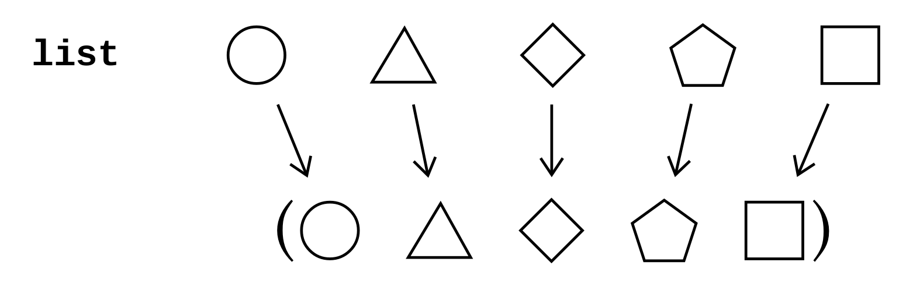
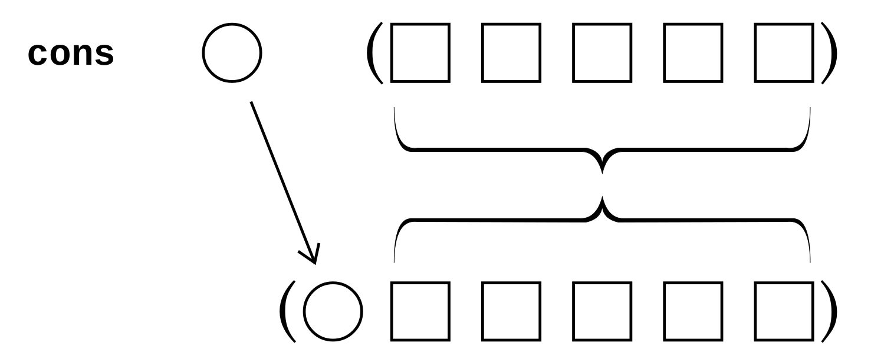
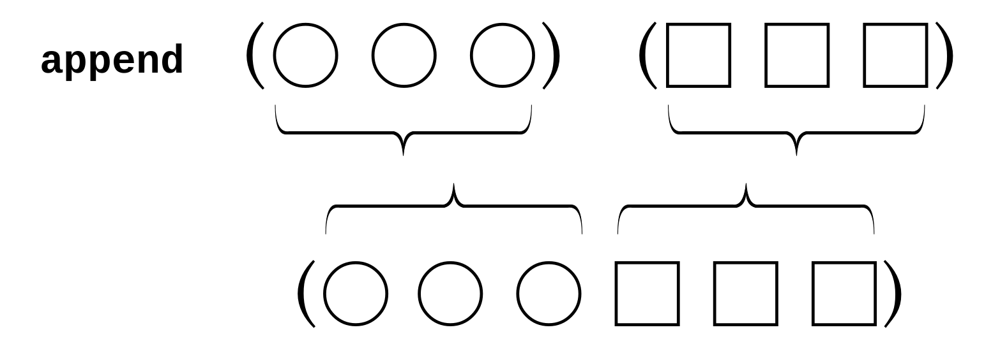
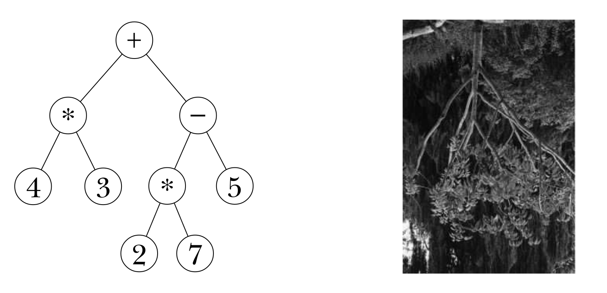
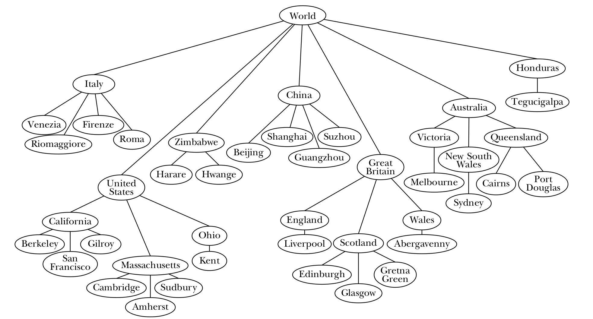
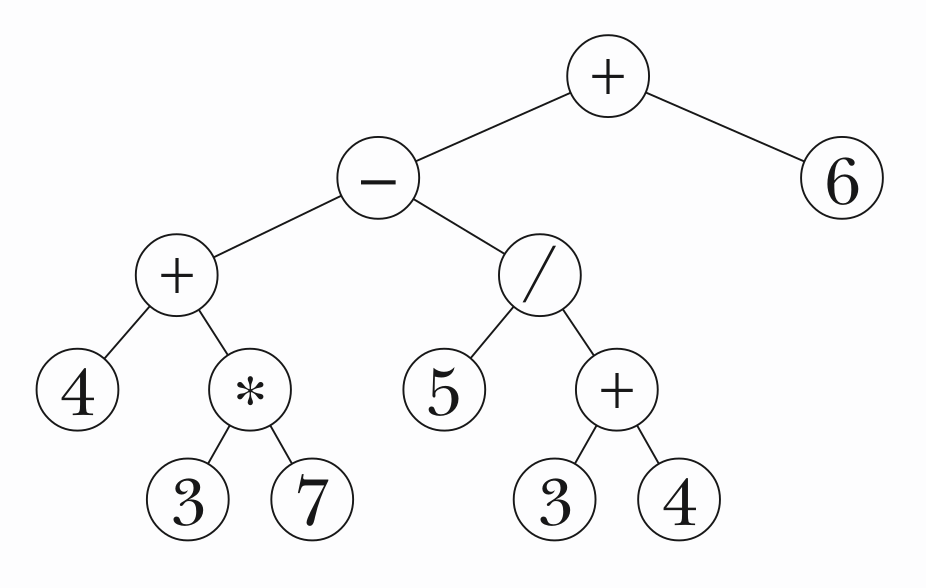

**What are the two kinds of abstraction specified in this part?**

- data abstraction
- the implementation of higher-order functions

## Chapter 17 Lists

**How to use list to define an icecream menu?**

```scheme
(vanilla (ultra chocolate) (heath bar crunch) ginger (cherry garcia))
```

This is meant to represent five flavors, two of which are named by single words, and the other three of which are named by sentences.

The data structure we’re using in this example is called a **_list_**.

**What are the differnces between a sentence and a list?**

|                |      lists       |      sentences       |
|----------------|:----------------:|:--------------------:|
| **elements**   |     anything     |        words         |
| **definition** | sefl-referential | non-self-referential |

A list that’s an element of another list is called a **_sublist_**. We’ll use the name **_structured_** list for a list that includes sublists.

**How to use lists in pattern matcher?**

We used list structure to hold known-values databases, such as

```scheme
((FRONT (YOUR MOTHER)) (BACK (SHOULD KNOW)))
```

_Lists are at the core of what Lisp has been about from its beginning. (In fact the name "Lisp" stands for "LISt Processing.")_

---

### Selectors and Constructors

**What are the _selectors_ of lists?**

- `car` -- to select the first element of a list.
- `cdr` -- to select the portion of a list containing all but the first element.

**What is the _predicate_ function to check for an empty list?**

- `null?` -- returns `#t` for the empty list, `#f` for anything else.

**What are the _constructors_ for lists?**

- `list` -- takes any number of arguments and returns a list with those arguments as its elements.

```scheme
(list (+ 2 3) 'squash (= 2 2) (list 4 5) remainder 'zucchini)
;(5 SQUASH #T (4 5) #<PROCEDURE> ZUCCHINI)
```



- `cons` -- takes two arguments, an element and a list and returns a new list whose `car` is the first argument and whose `cdr` is the second.

```scheme
(cons 'for '(no one))
; (FOR NO ONE)
```



- `append` -- combines the elements of two or more lists into a larger list.

```scheme
(append '(get back) '(the word))
; (GET BACK THE WORD)
```



```scheme
(list '(i am) '(the walrus))
; ((I AM) (THE WALRUS))

(cons '(i am) '(the walrus))
; ((I AM) THE WALRUS)

(append '(i am) '(the walrus))
; (I AM THE WALRUS)
```

---

### Programming with Lists

**How to define `praise` flavors function with `cons`?**

```scheme
(define (praise flavors)
  (if (null? flavors)                         ; if flavors is empty
      '()                                       ; return '()
      (cons (se (car flavors) '(is delicious))  ; or invoke recursive calls
            (praise (cdr flavors)))))

(praise '(ginger (ultra chocolate) lychee (rum raisin)))
; ((GINGER IS DELICIOUS) (ULTRA CHOCOLATE IS DELICIOUS)
;  (LYCHEE IS DELICIOUS) (RUM RAISIN IS DELICIOUS))
```

**How to define a En-Fr `translate` function with `car` and `cdr`?**

```scheme

(define (translate wd)
  (lookup wd '((window fenetre) (book livre) (computer ordinateur) ; Invoke function lookup
              (house maison) (closed ferme) (pate pate) (liver foie) ; define dictionary
              (faith foi) (weekend (fin de semaine))
              ((practical joke) attrape) (pal copain))))

(define (lookup wd dictionary)
  (cond ((null? dictionary) '(parlez-vous anglais?)) ; when dic is empty, return a sentence
        ((equal? wd (car (car dictionary))) ; when wd is equal to the car of car of dic
         (car (cdr (car dictionary)))) ; return car of cdr of car of dic
        (else (lookup wd (cdr dictionary))))) ; else invoke recursive call with cdr of dic

(translate 'computer)
; ORDINATEUR

(translate '(practical joke))
; ATTRAPE

(translate 'recursion)
; (PARLEZ-VOUS ANGLAIS?)
```

**What is the shorthand for `car` and `cdr` in scheme?**

`car` = `a`
`cdr` = `d`

And wrap `a` and `d` between `c` and `r`.

```scheme
(car (cdr (car dictionary)))
```

can be writtern in

```scheme
(cadar dictionary)
```

The most commonly used of these abbreviations are `cadr` , which selects the second
element of a list; `caddr` , which selects the third element; and `cadddr` , which selects the fourth.

---

### The Truth about Sentences

**What are sentences?**

_Sentences are lists._ Sentences are an abstract data type represented by lists. We created the sentence ADT by writing special selectors and constructors that provide a different way of using the same underlying machinery—a different interface, a different metaphor, a different point of view.

**What are the three differences between sentences and lists?**

- A sentence can contain only words, not sublists.
- Sentence selectors are symmetrical front-to-back.
- Sentences and words have the same selectors.

From Scheme’s ordinary point of view, an English sentence is just one particular case of a much more general data structure, whereas a _symbol_ is something entirely different.

> As we said in Chapter 5, “symbol” is the official name for words that are neither strings nor numbers.

**How to define `first` `last` `butfirst` `butlast` for sentences with Scheme list selectors?**

```scheme
(define (first sent)
  (car sent))

(define (last sent)
  (if (null? (cdr sent))  ; if the sent is null but the first element
      (car sent)          ; return the first element of the sent
      (last (cdr sent)))) ; or invoke the recursive call

(define (butfirst sent)
  (cdr sent))

(define (butlast sent)
  (if (null? (cdr sent))  ; if the sent is null but the first element
      '()                 ; return '()
      (cons (car sent) (butlast (cdr sent))))) ; or add the first element to result
```

---

### Higher-Order Functions

**What are the official list versions of `every` `keep` and `accumulate`?**

`map` `filter` and `reduce`

**How does `map` work?**

`map` takes two arguments, a function and a list, and returns a list containing the
result of applying the function to each element of the list.

```scheme
(map square '(9 8 7 6))
; (81 64 49 36)

(map (lambda (x) (se x x)) '(rocky raccoon))
; ((ROCKY ROCKY) (RACCOON RACCOON))

(every (lambda (x) (se x x)) '(rocky raccoon))
; (ROCKY ROCKY RACCOON RACCOON)

(map car '((john lennon) (paul mccartney)
           (george harrison) (ringo starr)))
; (JOHN PAUL GEORGE RINGO)

(map even? '(9 8 7 6))
; (#F #T #F #T)

(map (lambda (x) (word x x)) 'rain)     ; 'rain is not a list
; ERROR -- INVALID ARGUMENT TO MAP: RAIN
```

> **Where is the name `map` from?**

> The word “map” may seem strange for this function, but it comes from the mathematical study of functions, in which they talk about a mapping of the domain into the range. In this terminology, one talks about “mapping a function over a set” (a set of argument values, that is), and Lispians have taken over the same vocabulary, except that we talk about mapping over lists instead of mapping over sets.

**How does `filter` work?**

`filter` also takes a function and a list as arguments; it returns a list containing only
those elements of the argument list for which the function returns a true value. This
is the same as `keep`, except that the elements of the argument list may be sublists, and
their structure is preserved in the result.

```scheme
(filter (lambda (flavor) (member? 'swirl flavor))
        '((rum raisin) (root beer swirl) (rocky road) (fudge swirl)))
; ((ROOT BEER SWIRL) (FUDGE SWIRL))

(filter word? '((ultra chocolate) ginger lychee (raspberry sherbet)))
; (GINGER LYCHEE)

(filter (lambda (nums) (= (car nums) (cadr nums)))
        '((2 3) (4 4) (5 6) (7 8) (9 9)))
; ((4 4) (9 9))
```

`filter` is not a standard Scheme primitive, but it’s a universal convention; everyone defines it the same way we do.

**How does `reduce` work?**

`reduce` is just like `accumulate` except that it works only on lists, not on words. Neither is a built-in Scheme primitive; both names are seen in the literature. (The name “reduce” is official in the languages APL and Common Lisp, which do include this higher-order function as a primitive.)

```scheme
(reduce * '(4 5 6))
; 120

(reduce (lambda (list1 list2) (list (+ (car list1) (car list2))
                                    (+ (cadr list1) (cadr list2))))
        '((1 2) (30 40) (500 600)))
; (531 642)
```

---

### Other Primitives for Lists

* `list?` --  returns `#t` if its argument is a list, `#f` otherwise.
* `equal?`
* `member` -- like `member?` except for two differences: Its second argument must be a list (but can be a structured list); and instead of returning #t it returns the portion of the argument list starting with the element equal to the first argument.

```scheme
(member 'd '(a b c d e f g))
; (D E F G)

(member 'h '(a b c d e f g))
; #F
```

This is the main example in Scheme of the *semipredicate* idea that we mentioned earlier in passing. It doesn’t have a question mark in its name because it returns values other than #t and #f , but it works as a predicate because any non-`#f` value is considered true.

* `list-ref` -- like `item` execpt it counts items from zero instead of from one and takes its arguments in the other order:

```scheme
(list-ref '(happiness is a warm gun) 3)
; WARM
```

* `length` -- the same with `count` except that it doesn't work on words.

---

### Association Lists

**What is an association list?**

A list of names and corresponding values is called an *association list*, or an *a-list*.

**How to look up a name in an a-list?**

The Scheme primitive `assoc`

```scheme
(assoc 'george
       '((john lennon) (paul mccartney)
         (george harrison) (ringo starr)))
; (GEORGE HARRISON)

(assoc 'x '((i 1) (v 5) (x 10) (l 50) (c 100) (d 500) (m 1000)))
; (X 10)

(assoc 'ringo '((mick jagger) (keith richards) (brian jones)
                (charlie watts) (bill wyman)))
; #F
```

```scheme
(define dictionary
'((window fenetre) (book livre) (computer ordinateur)
  (house maison) (closed ferme) (pate pate) (liver foie)
  (faith foi) (weekend (fin de semaine))
  ((practical joke) attrape) (pal copain)))

(define (translate wd)
  (let ((record (assoc wd dictionary)))
    (if record
        (cadr record)
        '(parlez-vous anglais?))))
```

`assoc` returns `#f` if it can’t find the entry you’re looking for in your association list.

---

### Functions That Take Variable Numbers of Arguments

**How to use dot `.` to represent any number of arguments?**

```scheme
(define (increasing? number . rest-of-numbers)
  (cond ((null? rest-of-numbers) #t)
        ((> (car rest-of-numbers) number)
         (apply increasing? rest-of-numbers))
        (else #f)))

(increasing? 4 12 82)
; #T

(increasing? 12 4 82 107)
; #F
```

In listing the formal parameters of a procedure, you can *use a dot just before the last parameter to mean that that parameter ( rest-of-numbers in this case) represents any number of arguments, including zero. The value that will be associated with this parameter when the procedure is invoked will be a list whose elements are the actual argument values.*

*The number of formal parameters before the dot determines the minimum number of arguments that must be used when your procedure is invoked. There can be only one formal parameter after the dot.*

**How does procedure `apply` work?**

`apply` takes two arguments, a procedure and a list. Apply invokes the given procedure with the elements of the given list as its arguments, and returns whatever value the procedure returns. Therefore, the following two expressions are equivalent:

```scheme
(+ 3 4 5)

(apply + '(3 4 5))
```

**What is a rest parameter?**

A parameter that follows a dot and therefore represents a variable number of arguments is called a *rest parameter*.

---

### Recursion on Arbitrary Structured Lists

**If the entire book is stored in a list structure. How to define a function to lookup how many times a word apears in the book?**

```scheme
(define (deep-appearances wd structure)     ; higher-order version
  (if (word? structure)
      (if (equal? structure wd) 1 0)
      (reduce +
              (map (lambda (sublist) (deep-appearances wd sublist))
                    structure))))
```

**How to define `deep-appearances` without higher-order procedures?**

We deal with the base case—words—just as before. But for lists we do what we often do in trying to simplify a list problem: We divide the list into its first element (its `car`) and all the rest of its elements (its `cdr`).

```scheme
(define (deep-appearances wd structure)    ; compact-version
  (cond ((equal? wd structure) 1)          ; base case: desired word
        ((word? structure) 0)              ; base case: other word
        ((null? structure) 0)              ; base case: empty list
        (else (+ (deep-appearances wd (car structure))
                 (deep-appearances wd (cdr structure))))))
```

**In `deep-appearances` the desired result is a single number. What if we want to build a new list-of-lists structure? Having used `car` and `cdr` to disassemble a structure, we can use `cons` to build a new one.**

For example, we’ll translate our entire book into Pig Latin:

```scheme
(define (deep-pigl structure)
  (cond ((word? structure) (pigl structure))
        ((null? structure) '())
        (else (cons (deep-pigl (car structure))
                    (deep-pigl (cdr structure))))))
```

Compare `deep-pigl` with an every-pattern list recursion such as `praise` on page 285. Both look like

`(cons ( something (car argument)) ( something (cdr argument)))`

And yet these procedures are profoundly different. `praise` is a simple left-to-right walk through the elements of a sequence; `deep-pigl` dives in and out of sublists.  The difference is a result of the fact that `praise` does one recursive call, for the `cdr` , while `deep-pigl` does two, for the `car` as well as the `cdr`. The pattern exhibited by `deep-pigl` is called `car-cdr` recursion. (Another name for it is “tree recursion,” for a reason we’ll see in the next chapter.)

---

### Pitfalls

* Just as we mentioned about the names `word` and `sentence` , resist the temptation to use `list` as a formal parameter. We use `lst` instead, but other alternatives are capital `L` or `seq` (for “sequence”).

* The list constructor `cons` does not treat its two arguments equivalently. The second one must be the list you’re trying to extend. There is no equally easy way to extend a list on the right (although you can put the new element into a one-element list and use `append` ). If you get the arguments backward, you’re likely to get funny-looking results that aren’t lists, such as

```scheme
((3 . 2) . 1)
```

The result you get when you `cons` onto something that isn’t a list is called a _pair_. It’s sometimes called a “dotted pair” because of what it looks like when printed:

```scheme
(cons 'a 'b)
; (A . B)
```

It’s just the printed representation that’s dotted, however; the dot isn’t part of the pair any more than the parentheses around a list are elements of the list. Lists are made of pairs; that’s why `cons` can construct lists. But we’re not going to talk about any pairs that aren’t part of lists, so you don’t have to think about them at all, except to know that if dots appear in your results you’re consing backward.

* Don’t get confused between lists and sentences. Sentences have no internal structure; the good aspect of this is that it’s hard to make mistakes about building the structure, but the bad aspect is that you might need such a structure. You can have lists whose elements are sentences, but it’s confusing if you think of the same structure sometimes as a list and sometimes as a sentence.

* In reading someone else’s program, it’s easy not to notice that a procedure is making two recursive calls instead of just one. If you notice only the recursive call for the `cdr`, you might think you’re looking at a sequential recursion.

* If you’re writing a procedure whose argument is a list-of-lists, it may feel funny to let it also accept a word as the argument value. People therefore sometimes insist on a list as the argument, leading to an overly complicated base case. If your base case test says

```scheme
(word? (car structure))
```

then think about whether you’d have a better-organized program if the base case were

```scheme
(word? structure)
```

* Remember that in a deep-structure recursion you may need two base cases, one for reaching an element that isn’t a sublist, and the other for an empty list, with no elements at all. (Our `deep-appearances` procedure is an example.) Don’t forget the empty-list case.

---

### Exercises 17.1-17.3

[solutions](https://github.com/mengsince1986/Simply-Scheme-exercises/blob/master/SS%20Exercises/Exercises%2017.1-17.3.scm)

### Exercises 17.4-17.16

[solutions](https://github.com/mengsince1986/Simply-Scheme-exercises/blob/master/SS%20Exercises/Exercises%2017.4-17.16.scm)

---

## Chapter 18 Trees

The kinds of structures we’ll consider are called ***trees*** because they resemble trees in nature:



We’re going to begin by considering a tree as an abstract data type, without thinking about how lists are used to represent trees. For example, we’ll construct trees using a procedure named `make-node` , as if that were a Scheme primitive.

### Example: The World



**What is a node?**

It will be more useful to think of a node as a structure that includes everything below that circle also: *the datum and the children*. So when we think of the node for Great Britain, we’re thinking not only of the name “Great Britain,” but also of everything in Great Britain. *From this perspective, the root node of a tree includes the entire tree.* We might as well say that the node is the tree.

**How does the tree constructor work?**

The constructor for a tree is actually the constructor for one node, its root node. Our constructor for trees is therefore called `make-node` . It takes two arguments: *the datum and a (possibly empty) list of children.*

```scheme
(define world-tree                                          ;; painful -to-type version
  (make-node
   'world
   (list (make-node
          'italy
          (list (make-node 'venezia '())
                (make-node 'riomaggiore '())
                (make-node 'firenze '())
                (make-node 'roma '())))
         (make-node
          '(united states)
          (list (make-node 'california
                           (list (make-node 'berkeley '())
                                 (make-node '(san francisco) '())
                                 (make-node 'gilroy '())))
                (make-node 'massachusetts
                           (list (make-node 'cambridge '())
                                 (make-node 'amherst '())
                                 (make-node 'sudbury '()))))))))
```

**How do the tree selectors work?**

```scheme
(datum world-tree)
; WORLD

(datum (car (children world-tree)))
; ITALY

(datum (car (children (cadr (children world-tree)))))
; CALIFORNIA

(datum (car (children (car (children
                            (cadr (children world-tree)))))))
; BERKELEY
```

`datum` of a tree node returns the datum of that node. `children` of a node returns a list of the children of the node. (A list of trees is called a *forest*.)

**How to simplify `world-tree` with `leaf` and `cities`?**

```scheme
(define (leaf datum)
  (make-node datum '()))

(define (cities name-list)
  (map leaf name-list))
```

With these abbreviations the world tree is somewhat easier to define:

```scheme
(define world-tree
  (make-node
   'world
   (list (make-node
         'italy
         (cities '(venezia riomaggiore firenze roma)))
  (make-node
   '(united states)
   (list (make-node
          'california
          (cities '(berkeley (san francisco) gilroy)))
         (make-node
          'massachusetts
          (cities '(cambridge amherst sudbury)))
         (make-node 'ohio (cities '(kent)))))
  (make-node 'zimbabwe (cities '(harare hwange)))
  (make-node 'china
             (cities '(beijing shanghai guangzhou suzhou)))
  (make-node
   '(great britain)
   (list
    (make-node 'england (cities '(liverpool)))
    (make-node 'scotland
               (cities '(edinburgh glasgow (gretna green))))
    (make-node 'wales (cities '(abergavenny)))))
  (make-node
   'australia
   (list
    (make-node 'victoria (cities '(melbourne)))
    (make-node '(new south wales) (cities '(sydney)))
    (make-node 'queensland
               (cities '(cairns (port douglas))))))
  (make-node 'honduras (cities '(tegucigalpa))))))
```

---

### How Big Is My Tree?

**How to count cities in `world-tree` with `count-leaves`?**

```scheme
(define (count-leaves tree)
  (if (leaf? tree)
      1
      (reduce + (map count-leaves (children tree)))))

(define (leaf? node)
  (null? (children node)))

(count-leaves world -tree)
; 27
```

---

### Mutual Recursion

**How to write `count-leaves` by *mutual recursion*?**

```scheme
(define (count-leaves tree)
  (if (leaf? tree)
  1
  (count-leaves-in-forest (children tree))))

(define (count-leaves-in-forest forest)
  (if (null? forest)
  0
  (+ (count-leaves (car forest))
     (count-leaves-in-forest (cdr forest)))))
```

Note that `count-leaves` calls `count-leaves-in-forest` , and `count-leaves-in-forest` calls `count-leaves` . This pattern is called *mutual recursion*.

**How to understand *mutual recursion* in three different modes?**

* Mode 1

Initialization procedure: `count-leaves`

helper procedure: `count-leaves-in-forest`

The helper procedure follows the usual sequential list pattern: Do something to the `car` of the list, and recursively handle the `cdr` of the list. Now, what do we have to do to the `car`? In the usual sequential recursion, the `car` of the list is something simple, such as a word. What’s special about trees is that here the `car` is itself a tree, just like the entire data structure we started with. Therefore, we must invoke a procedure whose domain is trees: `count-leaves`.

This model is built on two ideas. One is the idea of *the domain of a function*; the reason we need two procedures is that we need one that takes a tree as its argument and one that takes a list of trees as its argument. The other idea is *the leap of faith*; we assume that the invocation of `count-leaves` within `count-leaves-in-forest` will correctly handle each child without tracing the exact sequence of events.

* Mode 2

Because of the *two-dimensional* nature of trees, in order to visit every node we have to be able to move in two different directions. From a given node we have to be able to move *down* to its children, but from each child we must be able to move *across* to its next sibling.

`count-leaves-in-forest`: move from left to right through a list of children.

`count-leaves`: move down one level by invoking `children`.

* Mode 3

The third model is also based on the two-dimensional nature of trees. Imagine for a moment that each node in the tree has at most one child. In that case, `count-leaves` could move from the root down to the single leaf with a structure very similar to the actual procedure, but carrying out a sequential recursion:

```scheme
(define (count-leaf tree)
  (if (leaf? tree)
  1
  (count-leaf (child tree))))
```

The trouble with this is that at each downward step there isn’t a single “next” node. Instead of a single path from the root to the leaf, there are multiple paths from the root to many leaves. *To make our idea of downward motion through sequential recursion work in a real tree, at each level we must “clone” `count-leaves` as many times as there are children.* `Count-leaves-in-forest` is the factory that manufactures the clones.  It hires one `count-leaves` little person for each child and accumulates their results.

*We use the name **tree recursion** for any situation in which a procedure invocation results in more than one recursive call, even if there isn’t an argument that’s a tree.*  Any structured list-of-lists has a somewhat tree-like, two-dimensional character even though it doesn’t use the formal mechanisms we’re exploring in this chapter. The `cdr` recursion is a “horizontal” one, moving from one element to another within the same list; the `car` recursion is a “vertical” one, exploring a sublist of the given list.

---

### Searching for a Datum in the Tree

Many tree problems don’t quite fit our higher-order functions. For example, let’s write a predicate `in-tree?` that takes the name of a place and a tree as arguments and tells whether or not that place is in the tree. It is possible to make it work with `filter` :

```scheme
(define (in-tree? place tree)
  (or (equal? place (datum tree))
      (not (null? (filter (lambda (subtree) (in-tree? place subtree))
                          (children tree))))))
```

This awkward construction also performs unnecessary computation. If the place we’re looking for happens to be in the first child of a node, `filter` will nevertheless look in all the other children as well. We can do better by replacing the use of `filter` with a mutual recursion:

```scheme
(define (in-tree? place tree)
  (or (equal? place (datum tree))
      (in-forest? place (children tree))))

(define (in-forest? place forest)
  (if (null? forest)
      #f
      (or (in-tree? place (car forest))
          (in-forest? place (cdr forest)))))

(in-tree? 'abergavenny world-tree)
; #T

(in-tree? 'abbenay world-tree)
; #F

(in-tree? 'venezia (cadr (children world-tree)))
; #F
```

A place is in a tree if one of two conditions holds: the place is the datum at the root of the tree, or the place is (recursively) in one of the child trees of this tree. That’s what `in-tree?` says. As for `in-forest?`, it says that a place is in one of a group of trees if the place is in the first tree, or if it’s in one of the remaining trees.

---

### Locating a Datum in the Tree

We’d like to be able to locate a city and find out all of the larger regions that enclose the city. For example, we want to say

```scheme
(locate 'berkeley world-tree)
; (WORLD (UNITED STATES) CALIFORNIA BERKELEY)
```

```scheme
(define (locate city tree)
  (if (equal? city (datum tree))
      (list city)
      (let ((subpath (locate-in-forest city (children tree))))
        (if subpath
            (cons (datum tree) subpath)
            #f))))

(define (locate-in-forest city forest)
  (if (null? forest)
      #f
      (or (locate city (car forest))
          (locate-in-forest city (cdr forest)))))
```

Compare the structure of `locate` with that of `in-tree?`. The helper procedures `in-forest?` and `locate-in-forest` are almost identical. The main procedures look different, because `locate` has a harder job, but both of them check for two possibilities: The city might be the datum of the argument node, or it might belong to one of the child trees.

---

### Representing Trees as Lists

**How do `make-node` , `datum` , and `children` work?**

```scheme
(define (make-node datum children)
  (cons datum children))

(define (datum node)
  (car node))

(define (children node)
  (cdr node))
```

In other words, **a tree is a list whose first element is the datum and whose remaining elements are subtrees.**

```scheme
world-tree

(WORLD
   (ITALY (VENEZIA) (RIOMAGGIORE) (FIRENZE) (ROMA))
   ((UNITED STATES)
    (CALIFORNIA (BERKELEY) ((SAN FRANCISCO)) (GILROY))
    (MASSACHUSETTS (CAMBRIDGE) (AMHERST) (SUDBURY))
    (OHIO (KENT)))
   (ZIMBABWE (HARARE) (HWANGE))
   (CHINA (BEIJING) (SHANGHAI) (GUANGSZHOU) (SUZHOW))
   ((GREAT BRITAIN)
    (ENGLAND (LIVERPOOL))
    (SCOTLAND (EDINBURGH) (GLASGOW) ((GRETNA GREEN)))
    (WALES (ABERGAVENNY)))
   (AUSTRALIA
    (VICTORIA (MELBOURNE))
    ((NEW SOUTH WALES) (SYDNEY))
    (QUEENSLAND (CAIRNS) ((PORT DOUGLAS))))
   (HONDURAS (TEGUCIGALPA)))
```

---

### Abstract Data Types

The procedures `make-node` , `datum` , and `children` define an abstract data type for trees. Using this ADT, we were able to write several useful procedures to manipulate trees before pinning down exactly how a tree is represented as a Scheme list.

**Why using ADT-specific selectors and constructors instead of `car` and `cdr` makes programs more readable?**

Consider this example:

```scheme
(in-tree? 'venezia (caddr world-tree))
```

What does `caddr` mean in this context? Is the `caddr` of a tree a datum? A child? A forest? Of course you could work it out by careful reasoning, but the form in which we presented this example originally was much clearer:

```scheme
(in-tree? 'venezia (cadr (children world-tree)))
```

Even better would be

```scheme
(in-tree? ’venezia (list-ref (children world -tree) 1))
```

**What do *respecting* the data abstraction and *data abstraction violation* mean?**

Using the appropriate selectors and constructors is called ***respecting*** the data abstraction. Failing to use the appropriate selectors and constructors is called a ***data abstraction violation***.

Having defined the selctors and constructors for trees ourselves how do we represent the tree in a different way?

```scheme
(define (make-node datum children)
  (list 'the 'node 'with 'datum datum 'and 'children children))

(define (datum node) (list-ref node 4))

(define (children node) (list-ref node 7))

> (make-node 'italy (cities '(venezia riomaggiore firenze roma)))
(THE NODE WITH DATUM ITALY AND CHILDREN
     ((THE NODE WITH DATUM VENEZIA AND CHILDREN ())
      (THE NODE WITH DATUM RIOMAGGIORE AND CHILDREN ())
      (THE NODE WITH DATUM FIRENZE AND CHILDREN ())
      (THE NODE WITH DATUM ROMA AND CHILDREN ())))
```

You might expect that this change in the representation would require changes to all the procedures we wrote earlier, such as `count-leaves`. But in fact, those procedures would continue to work perfectly because they don’t see the representation. (They respect the data abstraction.) As long as `datum` and `children` find the right information, it doesn’t matter how the trees are stored. *All that matters is that the constructors and selectors have to be compatible with each other.*

---

### An Advanced Example: Parsing Arithmetic Expressions

**What is the goal for `parse` function?**

Scheme uses *prefix notation*: `(+ 3 4)`.  By contrast, people who aren’t Scheme programmers generally represent arithmetic computations using an *infix notation*, in which the function symbol goes between two arguments: 3 + 4.

Our goal in this section is to translate an infix arithmetic expression into a tree representing the computation. This translation process is called *parsing* the expression.  For example, we’ll turn the expression

```
4 + 3 × 7 − 5/(3 + 4) + 6
```

into the tree



**How to define `parse` program?**

```scheme
(define (parse expr)
  (parse-helper expr '() '()))  ; invoke parse-helper and set operators and operands as '()

(define (parse-helper expr operators operands)
  (cond ((null? expr)  ; when expr is empty
         (if (null? operators)  ; if operators is empty
             (car operands)     ; return 1st of operands
             (handle-op '() operators operands)))  ; if operators is not empty invoke handle-op
        ((number? (car expr))  ; when 1st of expr is number
         (parse-helper (cdr expr)  ; invoke parse-helper. delete the 1st of expr
                       operators  ; pass the original operator pending list
                       (cons (make-node (car expr) '()) operands)))  ; make node with the 1st of expr and insert the new node the operands
        ((list? (car expr))  ; when 1st of expr is a list
         (parse-helper (cdr expr)  ; invoke parse-helper. delete the 1st of expr
                       operators  ; pass the original operator pending list
                       (cons (parse (car expr)) operands)))  ; pass the 1st of expr into operands list
        (else (if (or (null? operators)  ; when the 1st of expr is operator. if operators list is empty
                      (> (precedence (car expr))  ; or the current operator is greater than
                         (precedence (car operators))))  ; the 1st of the operator list (last operator)
                  (parse-helper (cdr expr)  ; invoke parse-helper. delte the 1st of expr
                                (cons (car expr) operators)  ; add the current operator to the operators list
                                operands)  ; pass original operands
                  (handle-op expr operators operands))))) ; if the current operator is lower than last operator, invoke handle-op

(define (handle-op expr operators operands)
  (parse-helper expr  ; invoke parse-helper
                (cdr operators)  ; delete the first element of operators
                (cons (make-node (car operators)  ; get the first of operators and set it as datum
                                 (list (cadr operands) (car operands)))  ; make the children with the 2nd and 1st element of operands
                      (cddr operands)))) ; delete the 1st and 2nd element of operands and insert the new list into the operands

(define (precedence oper)
  (if (member? oper '(+ -)) 1 2))
```

After building the tree it would be easy to compute the value of the expression. Here is the program to do that:

```scheme
(define (compute tree)
  (if (number? (datum tree))  ; if the datum of the tree is number
      (datum tree)  ; return the datum number
      ((function-named-by (datum tree))  ; if the datum of the tree is operator, invoke function-named-by with the operator to return the scheme operator
         (compute (car (children tree)))  ; get the first element of children as the first operand
         (compute (cadr (children tree)))))) ; get the rest of the children as another operand

(define (function-named-by oper)
  (cond ((equal? oper '+) +)
        ((equal? oper '-) -)
        ((equal? oper '*) *)
        ((equal? oper '/) /)
        (else (error "no such operator as" oper))))

(compute (parse '(4 + 3 * 7 - 5 / (3 + 4) + 6)))
; 30.285714285714
```

---

### Pitfalls

* A leaf node is a perfectly good actual argument to a tree procedure, even though the picture of a leaf node doesn’t look treeish because there aren’t any branches. A common mistake is to make the base case of the recursion be a node whose children are leaves, instead of a node that’s a leaf itself.

* The value returned by children is not a tree, but a forest. It’s therefore not a suitable actual argument to a procedure that expects a tree.

---

### Exercises 18.1-18.6

[Solutions](https://github.com/mengsince1986/Simply-Scheme-exercises/blob/master/SS%20Exercises/Exercises%2018.1-18.6.scm)

------------------------------------------------------------------------

## Chapter 19 Implementing Higher-Order Functions

This chapter is about writing *higher-order procedures* --- that is, procedures that implement higher-order functions. We are going to study the implementation of `every`, `keep`, and so on.

The truly important point made in this chapter is that you aren't limited to a fixed set of higher-order functions. If you feel a need for a new one, you can implement it.

------------------------------------------------------------------------

### Generalizing Patterns

**How to generalize a pattern to calculate areas for different kinds of shapes?**

Suppose we want to find out the areas of several different kinds of shapes, given one linear dimension. A straightforward way would be to do it like this:

```scheme
(define pi 3.141592654)

(define (square-area r) (* r r))

(define (circle-area r) (* pi r r))

(define (sphere-area r) (* 4 pi r r))

(define (hexagon-area r) (* (sqrt 3) 1.5 r r))

(square-area 6)
; 36

(circle-area 5)
; 78.53981635
```

We want to generalize the pattern that these four procedures exhibit.  Each of these procedures has a particular constant factor built in to its definition. What we'd like instead is one single procedure that lets you choose a constant factor when you invoke it. This new procedure will take a second argument besides the linear dimension `r` (the radius or side): a `shape` argument whose value is the desired constant factor.

```scheme
(define (area shape r) (* shape r r))

(define square 1)

(define circle pi)

(define sphere (* 4 pi))

(define hexagon (* (sqrt 3) 1.5))

(area sphere 7)
; 615.752160184
```

We started with several procedures. Then we found that they had certain points of similarity and certain differences. In order to write a single procedure that generalizes the points of similarity, we had to use an additional argument for each point of difference. (In this example, there was only one point of difference.)

This idea of using a procedure to generalize a pattern is part of the larger idea of abstraction that we've been discussing throughout the book. We notice an algorithm that we need to use repeatedly, and so we separate the algorithm from any particular data values and give it a name.

------------------------------------------------------------------------

### The `every` Pattern Revisited

**What is `every` template like?**

```scheme
(define ( every-something sent)
  (if (empty? sent)
      '()
      (se (_______ (first sent))
          (every -something (bf sent)))))
```

**How to define `every`?**

You've been writing `every`-like procedures by filling in the blank with a specific function. To generalize the pattern, we'll use the trick of adding an argument, as we discussed in the last section.

```scheme
(define (every fn sent)
  (if (empty? sent)
      '()
      (se (fn (first sent))
          (every fn (bf sent)))))
```

The version shown here does indeed work for words, because `first` and `butfirst` work for words. So probably "stuff" would be a better formal parameter than "sent." (The result from `every` is always a sentence, because `sentence` is used to construct the result.)

------------------------------------------------------------------------

### The Difference between `map` and `every`

**How to define `map` procedure?**

```scheme
(define (map fn lst)
  (if (null? lst)
      '()
      (cons (fn (car lst))
            (map fn (cdr lst)))))
```

The structure here is identical to that of `every`; the only difference is that we use `cons`, `car`, and `cdr` instead of `se`, `first` , and `butfirst`.

One implication of this is that you can't use `map` with a word, since it's an error to take the `car` of a word.

**When is it advantageous to use `map` instead of `every`?**

Suppose you're using `map` with a structured list, like this:

```scheme
(map (lambda (flavor) (se flavor '(is great)))
     '(ginger (ultra chocolate) pumpkin (rum raisin)))
; ((GINGER IS GREAT) (ULTRA CHOCOLATE IS GREAT)
;  (PUMPKIN IS GREAT) (RUM RAISIN IS GREAT))

(every (lambda (flavor) (se flavor '(is great)))
       '(ginger (ultra chocolate) pumpkin (rum raisin)))
; (GINGER IS GREAT ULTRA CHOCOLATE IS GREAT PUMPKIN IS GREAT
;  RUM RAISIN IS GREAT)
```

**Why does `map` preserve the structure of the sublists while `every` doesn't?**

`map` uses `cons` to combine the elements of the result, whereas `every` uses `sentence` :

```scheme
(cons '(pumpkin is great)
      (cons '(rum raisin is great)
            '()))
; ((PUMPKIN IS GREAT) (RUM RAISIN IS GREAT))

(se '(pumpkin is great)
    (se '(rum raisin is great)
        '()))
; (PUMPKIN IS GREAT RUM RAISIN IS GREAT)
```

------------------------------------------------------------------------

### `filter`

**How to define `filter`?**

```scheme
(define (filter pred lst)
  (cond ((null? lst) '())
        ((pred (car lst))
         (cons (car lst) (filter pred (cdr lst))))
        (else (filter pred (cdr lst)))))
```

Like `map`, this uses `cons` as the constructor so that it will work properly on structured lists.

(Aside from the difference between lists and sentences, this is just like the keep template on page 224.)

------------------------------------------------------------------------

### `accumulate` and `reduce`

**How to define accumulate with only two arguments?**

*The trick is that in our `reduce` and `accumulate` the base case is a one-element argument*, rather than an empty argument. When we're down to one element in the argument, we just return that element:

```scheme
(define (accumulate combiner stuff)  ;; first version
  (if (empty? (bf stuff))
      (first stuff)
      (combiner (first stuff)
                (accumulate combiner (bf stuff)))))
```

This version is a simplification of the one we actually provide. What happens if `stuff` is empty? This version blows up, since it tries to take the `butfirst` of stuff immediately. Our final version has a specific check for empty arguments:

```scheme
(define (accumulate combiner stuff)
  (cond ((not (empty? stuff)) (real-accumulate combiner stuff))
        ((member combiner (list + * word se append))
         (combiner))
        (else (error
               "Can’t accumulate empty input with that combiner"))))

(define (real-accumulate combiner stuff)
  (if (empty? (bf stuff))
      (first stuff)
      (combiner (first stuff) (real-accumulate combiner (bf stuff)))))
```

`reduce` is the same, except that it uses `null?`, `car`, and `cdr`.

As we mentioned in Chapter 8, many of Scheme's primitive procedures return their identity element when invoked with no arguments. We can take advantage of this; if `accumulate` is invoked with an empty second argument and one of the procedures `+`, `*`, `word`, `sentence`, `append` or `list`, we invoke the combiner with no arguments to produce the return value.

On the other hand, if `accumulate`'s combiner argument is something like `(lambda (x y) (word x ’- y))` or `max`, then there's nothing `accumulate` can return, so we give an error message.

------------------------------------------------------------------------

### Robustness

**How to define `accumulate` in a non-robust version?**

```scheme
(define (accumulate combiner stuff)   ;; non-robust version
  (if (not (empty? stuff))
      (real-accumulate combiner stuff)
      (combiner)))
```

**What is the reasoning in favor of non-robust programming?**

In either version, the user who tries to evaluate an expression like

```scheme
(accumulate max '())
```

is going to get an error message. In the longer version we’ve spent both our own programming effort and a little of the computer’s time on every invocation just to give a *different* error message from the one that Scheme would have given anyway. What’s the point?

**What is the reasoning in favor of the robust programming?**

Here is the reasoning in favor of the longer version: In practice, the empty-argument situation isn’t going to arise because someone uses a quoted empty sentence; instead the second argument to accumulate will be some expression whose value happens to be empty under certain conditions. The user will then have to debug the program that caused those conditions. Debugging is hard; we should make it easier for the user, if we can, by giving an error message that points clearly to the problem.

**What is a robust program?**

A program that behaves politely when given incorrect input is called *robust*. It’s not always a matter of better or worse error messages.

**Robust program vs non-robust program?**

It’s possible to pay either too little or too much attention to program robustness. If you’re a professional programmer, your employer will expect your programs to survive errors that are likely to happen. On the other hand, your programs will be hard to read and debug if the error checking swamps the real work! As a student, unless you are specifically asked to “bulletproof” your program, don’t answer exam questions by writing procedures like this one:

```scheme
(define (even? num)  ;; silly example
  (cond ((not (number? num)) (error "Not a number."))
        ((not (integer? num)) (error "Not an integer."))
        ((< num 0) (error "Argument must be positive."))
        (else (= (remainder num 2) 0))))
```

---

### Higher-Order Functions for Structured Lists

Any time you notice yourself writing what feels like the same procedure over again, but with different details, consider inventing a higher-order function.

For example, here’s a procedure we defined in Chapter 17.

```scheme
(define (deep-pigl structure)
  (cond ((word? structure) (pigl structure))
        ((null? structure) '())
        (else (cons (deep-pigl (car structure))
                    (deep-pigl (cdr structure))))))
```

This procedure converts every word in a structured list to Pig Latin. Suppose we have a structure full of numbers and we want to compute all of their squares. We could write a specific procedure `deep-square` , but instead, we’ll write a higher-order procedure:

```scheme
(define (deep-map f structure)
  (cond ((word? structure) (f structure))
        ((null? structure) '())
        (else (cons (deep-map f (car structure))
                    (deep-map f (cdr structure))))))
```

---

### The Zero-trip Do Loop

**What is the `do` control mechanism in Fortran?**

Fortran includes a control mechanism called `do`, a sort of higher-order procedure that carries out a computation repeatedly, as `every` does. But instead of carrying out the computation once for each element of a given collection of data (like the sentence argument to `every`), `do` performs a computation once for each integer in a range specified by its endpoints. “For every number between 4 and 16, do such-and-such.”

**What is "zero-trip `do` loop" proposal?**

What if you specify endpoints such that the starting value is greater than the ending value? In the first implementation of Fortran, nobody thought very hard about this question, and they happened to implement `do` in such a way that if you specified a backward range, the computation was done once, for the given starting value, before Fortran noticed that it was past the ending value.

Twenty years later, a bunch of computer scientists argued that this behavior was wrong—that a `do` loop with its starting value greater than its ending value should not carry out its computation at all. This proposal for a “*zero-trip do loop*” was strongly opposed by Fortran old-timers, not because of any principle but because of all the thousands of Fortran programs that had been written to rely on the one-trip behavior.

**What is the point of "zero-trip `do` loop" story?**

The point of this story is that the Fortran users had to debate the issue so heatedly because they are stuck with only the control mechanisms that are built into the language.  Fortran doesn’t have the idea of function as data, so Fortran programmers can’t write their own higher-order procedures. But you, using the techniques of this chapter, can create precisely the control mechanism that you need for whatever problem you happen to be working on.

---

### Pitfalls

* The most crucial point in inventing a higher-order function is to make sure that the pattern you have in mind really does generalize. For example, if you want to write a higher-order function for structured data, what is the base case? Will you use the tree abstract data type, or will you use car / cdr recursion?

* When you generalize a pattern by adding a new argument (typically a procedure), be sure you add it to the recursive invocation(s) as well as to the formal parameter list!

---

### Exercises 19.1

[Solution]()

### Exercises 19.2-19.13

[Solution]()
