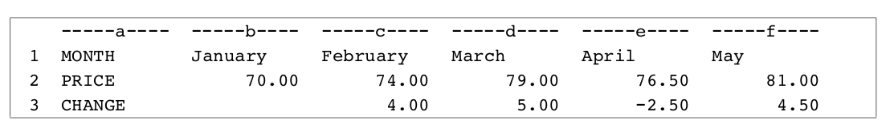
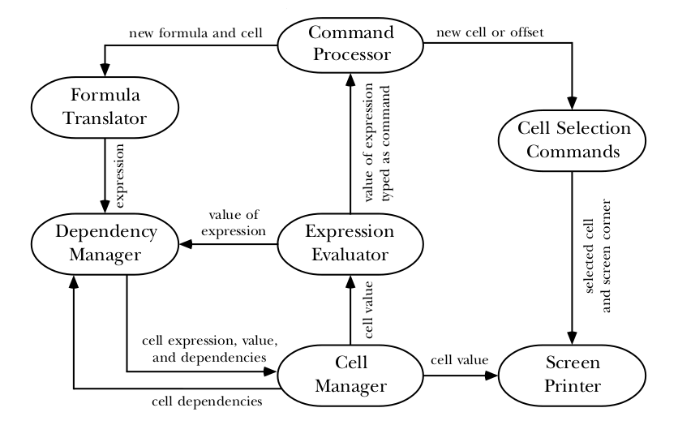
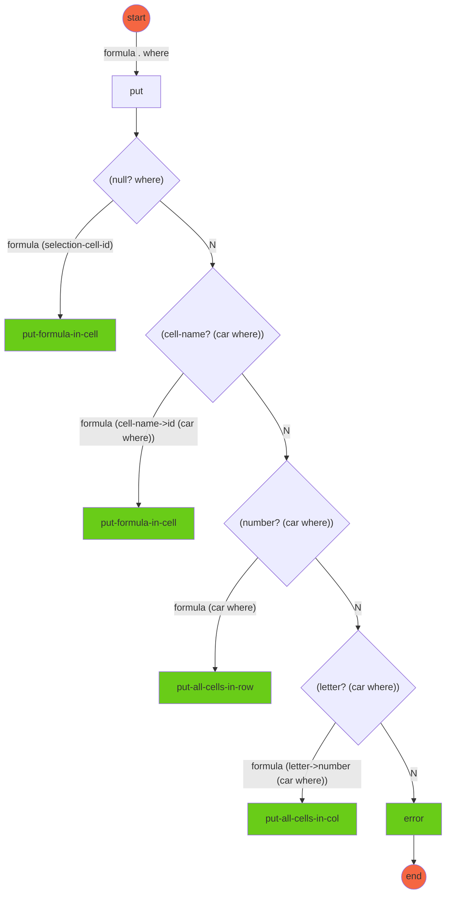
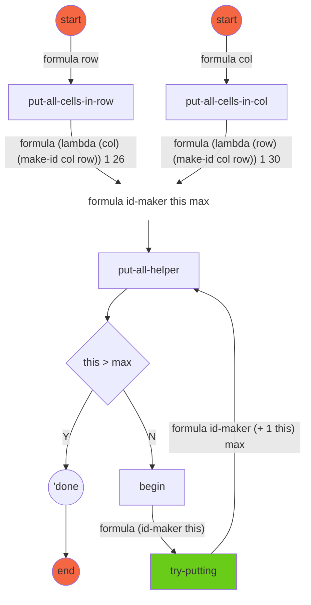
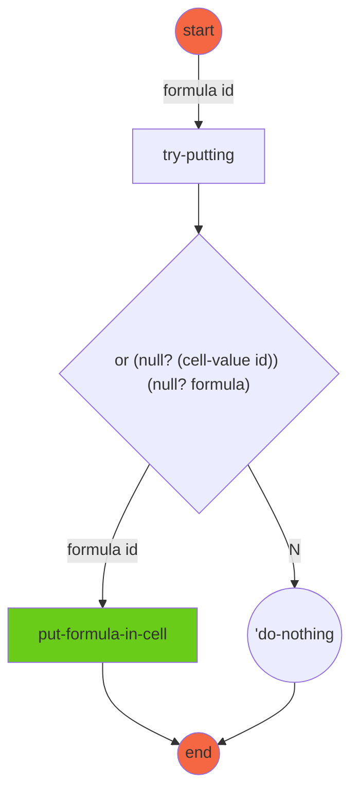
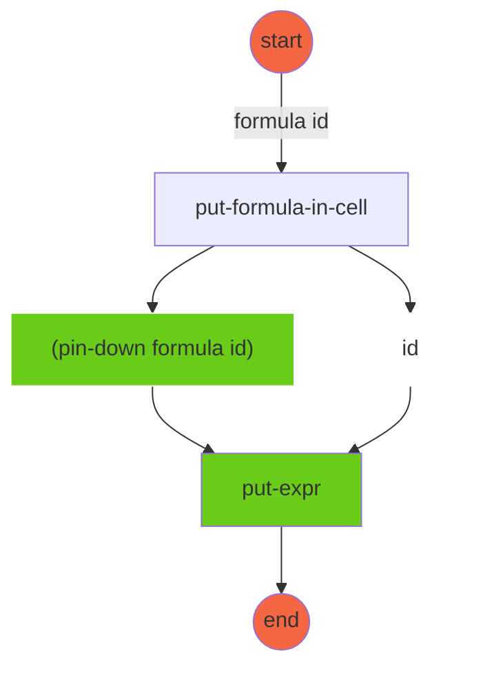
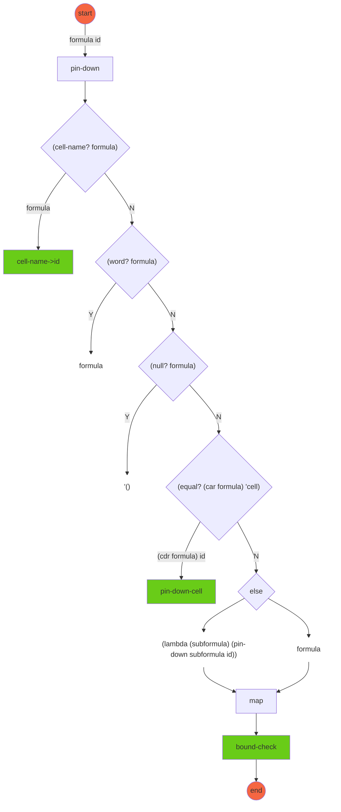
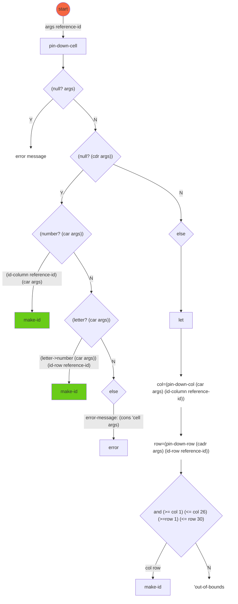
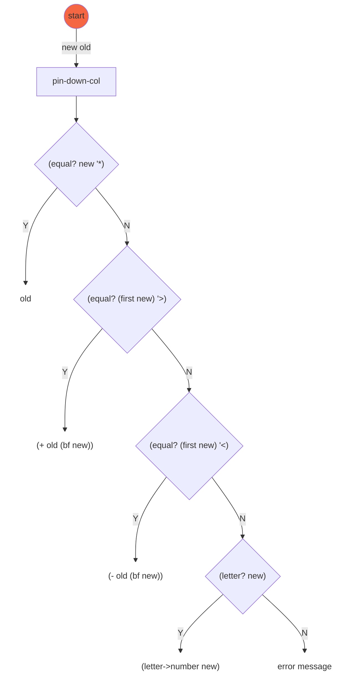

# Part VI Sequential Programming

The three big ideas in this part are *effect*, *sequence*, and *state*.

**What is *effect*?**

In this part of the book we're going to talk about giving commands to the computer as well as asking it questions. That is, we'll invoke procedures that tell Scheme to do something. Instead of merely computing a value, such a procedure has an *effect*, an action that changes something.

**What is *sequence*?**

Once we're thinking about actions, it's very natural to consider a *sequence* of actions.  First cooking dinner, then eating, and then washing the dishes is one sequence.

**What is *sequential programming*?**

Most books compare a program to a recipe or a sequence of instructions, along the lines of

```
to go-to-work
  get-dressed
  eat-breakfast
  catch-the-bus
```

This *sequential programming* style is simple and natural, and it does a good job of modeling computations in which the problem concerns a sequence of events. If you're writing an airline reservation system, a sequential program with `reserve-seat` and `issue-ticket` commands makes sense. But if you want to know the acronym of a phrase, that's not inherently sequential, and a question-asking approach is best.

**What is *state*?**

Some actions that Scheme can take affect the “outside” world, such as printing something on the computer screen. But Scheme can also carry out internal actions, invisible outside the computer, but changing the environment in which Scheme itself carries out computations. Defining a new variable with `define` is an example; before the definition, Scheme wouldn't understand what that name means, but once the definition has been made, the name can be used in evaluating later expressions.

Scheme's knowledge about the leftover effects of past computations is called its *state*. The third big idea in this part of the book is that *we can write programs that maintain state information and use it to determine their results.*

**How does the notion of *sequence* and *state* contradict functional programming?**

Like *sequence*, the notion of *state* contradicts functional programming. Earlier in the book, we emphasized that every time a function is invoked with the same arguments, it must return the same value. But a procedure whose returned value depends on *state*—on the past history of the computation—might return a different value on each invocation, even with identical arguments.

**What are the three useful situations for *effects*, *sequence* and *state*?**

* Interactive, question-and-answer programs that involve keyboard input while the com- putation is in progress;
* Programs that must read and write long-term data file storage;
* Computations that model an actual sequence of events in time and use the state of the program to model information about the state of the simulated events.

After introducing Scheme's mechanisms for sequential programming, we'll use those mechanisms to implement versions of two commonly used types of business computer applications, a spreadsheet and a database program.

---

## Chapter 20 Input and Output

### Printing

**How to print the lyrics of "99 Bottles of Beer on the Wall" with scheme?**

We'll write a program to print a verse, rather than return it in a list:

```scheme
(define (bottles n)
  (if (= n 0)
      'burp
      (begin (verse n)
             (bottles (- n 1)))))

(define (verse n)
(show (cons n '(bottles of beer on the wall)))
(show (cons n '(bottles of beer)))
(show '(if one of those bottles should happen to fall))
(show (cons (- n 1) '(bottles of beer on the wall)))
(show '()))

(bottles 3)
; (3 BOTTLES OF BEER ON THE WALL)
; (3 BOTTLES OF BEER)
; (IF ONE OF THOSE BOTTLES SHOULD HAPPEN TO FALL)
; (2 BOTTLES OF BEER ON THE WALL)
; ()
; (2 BOTTLES OF BEER ON THE WALL)
; (2 BOTTLES OF BEER)
; (IF ONE OF THOSE BOTTLES SHOULD HAPPEN TO FALL)
; (1 BOTTLES OF BEER ON THE WALL)
; ()
; (1 BOTTLES OF BEER ON THE WALL)
; (1 BOTTLES OF BEER)
; (IF ONE OF THOSE BOTTLES SHOULD HAPPEN TO FALL)
; (0 BOTTLES OF BEER ON THE WALL)
; ()
; BURP
```

Why was "burp" printed at the end? Just because we're printing things explicitly doesn't mean that the read-eval-print loop stops functioning. We typed the expression `(bottles 3)` . In the course of evaluating that expression, Scheme printed several lines for us. But the value of the expression was the word burp, because that's what bottles returned.

---

### Side Effects and Sequencing

**How does procedure `show` work?**

The procedures we've used compute and return a value, and do nothing else. `show` is different. Although every Scheme procedure returns a value, *the Scheme language standard doesn't specify what value the printing procedures should return*. Instead, we are interested in their side effects. *we invoke show because we want it to do something, namely, print its argument on the screen.*

Suppose `show` returns `#f` in your version of Scheme. Then you might see

```scheme
(show 7)
; 7
; #F
```

But since the return value is unspecified, we try to write programs in such a way that *we never use `show`'s return value as the return value from our procedures.*

**What is "side effect"?**

What exactly do we mean by “side effect”? The kinds of procedures that we've used before this chapter can compute values, invoke helper procedures, provide arguments to the helper procedures, and return a value. There may be a lot of activity going on within the procedure, but the procedure affects the world outside of itself only by returning a value that some other procedure might use. `show` affects the world outside of itself by putting something on the screen. After show has finished its work, someone who looks at the screen can tell that show was used.

The term *side effect* is based on the idea that a procedure may have a useful return value as its main purpose and may also have an effect “on the side.” It's a misnomer to talk about the side effect of `show`, since the effect is its main purpose.

**What is the difference between values and effects?**

Here's an example to illustrate the difference between values and effects:

```scheme
(define (effect x)
  (show x)
  'done)

(define (value x)
  x)

(effect '(oh! darling))
; (OH! DARLING)
; DONE

(value '(oh! darling))
; (OH! DARLING)

(bf (effect '(oh! darling)))
; (OH! DARLING)
; ONE

(bf (value '(oh! darling)))
; (DARLING)

(define (lots-of-effect x)
  (effect x)
  (effect x)
  (effect x))

(define (lots-of-value x)
  (value x)
  (value x)
  (value x))

(lots-of-effect '(oh! darling))
; (OH! DARLING)
; (OH! DARLING)
; (OH! DARLING)
; DONE

(lots-of-value '(oh! darling))
; (OH! DARLING)
```

This example also demonstrates the second new idea, *sequencing*: Each of `effect`, `lots-of-effect`, and `lots-of-value` contains more than one expression in its body. When you invoke such a procedure, *Scheme evaluates all the expressions in the body, in order, and returns the value of the last one.* This also works in the body of a `let`, which is really the body of a procedure, and in each clause of a `cond`.

```scheme
(cond ((< 4 0)
       (show '(how interesting))
       (show '(4 is less than zero?))
       #f)
      ((> 4 0)
       (show '(more reasonable))
       (show '(4 really is more than zero))
       'value)
      (else
       (show '(you mean 4=0?))
       #f))

; (MORE REASONABLE)
; (4 REALLY IS MORE THAN ZERO)
; VALUE
```

> In Chapter 4, we said that the body of a procedure was always one single expression. We lied. *But as long as you don't use any procedures with side effects, it doesn't do you any good to evaluate more than one expression in a body.*

When we invoked `lots-of-value`, Scheme invoked `value` three times; it discarded the values returned by the first two invocations, and returned the value from the third invocation. Similarly, when we invoked `lots-of-effect`, Scheme invoked `effect` three times and returned the value from the third invocation. But each invocation of `effect` caused its argument to be printed by invoking `show`.

---

### The `begin` Special Form

**Why is that multiple expressions can't be used in an `if` construction?**

The `lots-of-effect` procedure accomplished sequencing by having more than one expression in its body. This works fine if the sequence of events that you want to perform is the entire body of a procedure. But in `bottles` we wanted to include a sequence as one of the alternatives in an `if` construction. We couldn't just say

```scheme
(define (bottles n)
  (if (= n 0)
      '()
      (verse n)
      (bottles (- n 1))))
```

because `if` must have exactly three arguments. Otherwise, how would `if` know whether we meant `(verse n)` to be the second expression in the true case, or the first expression in the false case?

**How does `begin` work?**

Instead, to turn the sequence of expressions into a single expression, we use the special form `begin`. *It takes any number of arguments, evaluates them from left to right, and returns the value of the last one.*

```scheme
(define bottles n)
(if (= n 0)
'burp
(begin (verse n)
(bottles (- n 1)))))
```

(One way to think about sequences in procedure bodies is that every procedure body has an invisible `begin` surrounding it.)

---

### This isn't Functional Programming

**What is the difference between a function and procedure?**

Sequencing and side effects are radical departures from the idea of functional programming. In fact, we'd like to reserve the name *function* for something that computes and returns one value, with no side effects.

“*Procedure*” is the general term for the thing that lambda returns—an embodiment of an algorithm. If the algorithm is the kind that computes and returns a single value without side effects, then we say that the procedure implements a function.

> Sometimes people sloppily say that the procedure is a function. In fact, you may hear people be really sloppy and call a non-functional procedure a function!

**Is there sequencing in functional programming?**

There is a certain kind of sequencing even in functional programming. If you say

```scheme
(* (+ 3 4) (- 92 15))
```

it's clear that the addition has to happen before the multiplication, because the result of the addition provides one of the arguments to the multiplication.

What's new in the sequential programming style is the emphasis on *sequence*, and the fact that the expressions in the sequence are independent instead of contributing values to each other. In this multiplication problem, for example, we don't care whether the addition happens before or after the subtraction. If the addition and subtraction were in a sequence, we'd be using them for independent purposes:

```scheme
(begin
 (show (+ 3 4))
 (show (- 92 15)))
```

This is what we mean by being independent. *Neither expression helps in computing the other. And the order matters because we can see the order in which the results are printed.*

---

### Not Moving to the Next Line

**How to make a program print several things on the same line?**

```scheme
(begin (show-addition 3 4)
       (show-addition 6 8)
       'done)

; 3+4=7
; 6+8=14
; DONE
```

We use `display`, which doesn't move to the next line after printing its argument:

```scheme
(define (show-addition x y)
  (display x)
  (display '+)
  (display y)
  (display '=)
  (show (+ x y)))
```

(The last one is a show because we do want to start a new line after it.)

**How to print a blank line?**

You use `newline`:

```scheme
(define (verse n)
  (show (cons n '(bottles of beer on the wall)))
  (show (cons n '(bottles of beer)))
  (show '(if one of those bottles should happen to fall))
  (show (cons (- n 1) '(bottles of beer on the wall)))
  (newline))                                                       ; replaces (show '())
```

In fact, `show` isn't an official Scheme primitive; we wrote it in terms of `display` and `newline` .

---

### Strings

**What are strings?**

*Strings* are words enclosed in double-quote marks so that Scheme will permit the use of punctuation or other unusual characters. Strings also preserve the case of letters, so they can be used to beautify our song even more.

**How to beautify "99 Bottles of Beer on the Wall" with strings?**

Since any character can be in a string, including spaces, the easiest thing to do in this case is to treat all the letters, spaces, and punctuation characters of each line of the song as one long word.

```scheme
(define (verse n)
  (display n)
  (show " bottles of beer on the wall,")
  (display n)
  (show " bottles of beer.")
  (show "If one of those bottles should happen to fall,")
  (display (- n 1))
  (show " bottles of beer on the wall.")
  (newline))

(verse 6)
; 6 bottles of beer on the wall,
; 6 bottles of beer.
; If one of those bottles should happen to fall,
; 5 bottles of beer on the wall.
; #F                                             ; or whatever is returned by (newline)
```

It's strange to think of “bottles of beer on the wall,” as a single word. But *the rule is that anything inside double quotes counts as a single word. It doesn't have to be an English word.*

---

### A Higher-Order Procedure for Sequencing

**How to print each element of a list?**

```scheme
(define (show-list lst)
  (if (null? lst)
      'done
      (begin (show (car lst))
             (show-list (cdr lst)))))

(show-list '((dig a pony) (doctor robert) (for you blue)))
; (DIG A PONY)
; (DOCTOR ROBERT)
; (FOR YOU BLUE)
; DONE
```

**How to abstract `show-list` into a higher order procedure? (We can't call it a “higher-order function” because this one is for computations with side effects.)**

The procedure `for-each` is part of standard Scheme:

```scheme
(for-each show '((mean mr mustard) (no reply) (tell me why)))
; (MEAN MR MUSTARD)
; (NO REPLY)
; (TELL ME WHY)
```

The value returned by `for-each` is unspecified.

**Why is that we use `for-each` instead of `map` to print each element of a list?**

There are two reasons. One is just an efficiency issue: `map` constructs a list containing the values returned by each of its sub-computations; in this example, it would be a list of three instances of the unspecified value returned by `show`. But we aren't going to use that list for anything, so there's no point in constructing it.

The second reason is more serious. *In functional programming, the order of evaluation of subexpressions is unspecified.* For example, when we evaluate the expression

```scheme
(- (+ 4 5) (* 6 7))
```

we don't know whether the addition or the multiplication happens first. Similarly, the order in which `map` computes the results for each element is unspecified. That’s okay as long as the ultimately returned list of results is in the right order. But when we are using side effects, we do care about the order of evaluation. In this case, we want to make sure that the elements of the argument list are printed from left to right. `for-each` guarantees this ordering.

---

### Tic-Tac-Toe Revisited

We’re working up toward playing a game of tic-tac-toe against the computer. But as a first step, let’s have the computer play against itself.

What we already have is `ttt`, a strategy function: one that takes a board position as argument (and also a letter x or o ) and returns the chosen next move.

**How to define `stupid-ttt` as an alternative strategy?**

```scheme
(define (stupid-ttt position letter)
  (location '_ position))

(define (location letter word)
  (if (equal? letter (first word))
      1
      (+ 1 (location letter (bf word)))))
```

**How to write a program `play-ttt` that takes two strategies as arguments and plays a game between them?**

```scheme
(define (play-ttt x-strat o-strat)
  (play-ttt-helper x-strat o-strat '_________ 'x))

(define (play-ttt-helper x-strat o-strat position whose-turn)
  (cond ((already-won? position (opponent whose-turn))
         (list (opponent whose-turn) 'wins!))
        ((tie-game? position) '(tie game))
        (else (let ((square (if (equal? whose-turn 'x)
                                (x-strat position 'x)
                                (o-strat position 'o))))
                (play-ttt-helper x-strat
                                 o-strat
                                 (add-move square whose-turn position)
                                 (opponent whose-turn))))))

(define (already-won? position who)
  (member? (word who who who) (find-triples position)))

(define (tie-game? position)
  (not (member? '_ position)))
```

**How to define `add-move`?**

The procedure `add-move` takes a square and an old position as arguments and returns the new position.

```scheme
(define (add-move square letter position)
  (if (= square 1)
      (word letter (bf position))
      (word (first position)
            (add-move (- square 1) letter (bf position)))))

(play-ttt ttt stupid-ttt)
; (X WINS!)

(play-ttt stupid-ttt ttt)
; (O WINS!)
```

---

### Accepting User Input

**How to define a strategy procedure `ask-user` that asks the user where to move?**

```scheme
(define (ask-user position letter)
  (print-position position)
  (display letter)
  (display "’s move: ")
  (read))

(define (print-position position)    ;; first version
  (show position))

(play-ttt ttt ask-user)
; ____X____
; O’S MOVE: 1
; O___XX___
; O’S MOVE: 4
; O__OXXX__
; O’S MOVE: 3
; OXOOXXX__
; O’S MOVE: 8
; (TIE GAME)
```

What the user typed is just the single digits shown in boldface at the ends of the lines.

**How does procedure `read` work?**

`read` waits for you to type a Scheme expression, and returns that expression. Don’t be confused: `read` does not evaluate what you type. It returns exactly the same expression that you type:

```scheme
(define (echo)
  (display "What? ")
  (let ((expr (read)))
    (if (equal? expr 'stop)
        'okay
        (begin
         (show expr)
         (echo)))))

(echo)
; What? hello
; HELLO
; What? (+ 2 3)
; (+ 2 3)
; What? (first (glass onion))
; (FIRST (GLASS ONION))
; What? stop
; OKAY
```

---

### Aesthetic Board Display

```scheme
(define (print-position position)
  (print-row (subword position 1 3))
  (show "-+-+-")
  (print-row (subword position 4 6))
  (show "-+-+-")
  (print-row (subword position 7 9))
  (newline))

(define (print-row row)
  (maybe-display (first row))
  (display "|")
  (maybe-display (first (bf row)))
  (display "|")
  (maybe-display (last row))
  (newline))

(define (maybe-display letter)
  (if (not (equal? letter '_))
      (display letter)
      (display " ")))

(define (subword wd start end)      ; higher-order version
  ((repeated bf (- start 1))
   ((repeated bl (- (count wd) end))
    wd)))

(define (subword wd start end)
  (cond ((> start 1) (subword (bf wd) (- start 1) (- end 1)))
        ((< end (count wd)) (subword (bl wd) start end))
        (else wd)))
```

```scheme
(print-position '_x_oo__xx)
;  |X|
; -+-+-
; O|O|
; -+-+-
;  |X|X
```

---

### Reading and Writing Normal Text

**When do we use `read`?**

The `read` procedure works fine as long as what you type looks like a Lisp program. That is, it *reads one expression at a time.*

**How does `read-line` in simply.scm work?**

We’ve provided a procedure `read-line` that reads one line of input and returns a sentence. The words in that sentence will contain any punctuation characters that appear on the line, including parentheses, which are not interpreted as sublist delimiters by `read-line`. `read-line` also preserves the case of letters.

**How to define `music-critic` to read more than one word with `read-line`?**

```scheme
(define (music-critic)
  (read-line)
  (show "What’s your favorite Beatles song?")
  (let ((song (read-line)))
    (show (se "I like" song "too."))))

(music-critic)
; What’s your favorite Beatles song?
; She Loves You
; (I like She Loves You too.)
```

**Why do we call `read-line` and ignores its result at the beginning of `music-critic`?**

It has to do with the interaction between `read-line` and `read`. *`read` treats what you type as a sequence of Scheme expressions; each invocation of `read` reads one of them.* `read` pays no attention to formatting details, such as several consecutive spaces or line breaks. If, for example, you type several expressions on the same line, it will take several invocations of `read` to read them all.

By contrast, *`read-line` treats what you type as a sequence of lines, reading one line per invocation, so it does pay attention to line breaks.*

Either of these ways to read input is sensible in itself, but if you mix the two, by invoking `read` sometimes and `read-line` sometimes in the same program, the results can be confusing. Suppose you type a line containing an expression and your program invokes `read` to read it. Since there might have been another expression on the line, `read` doesn’t advance to the next line until you ask for the next expression. So if you now invoke `read-line`, thinking that it will read another line from the keyboard, it will instead return an empty list, because what it sees is an empty line—what’s left after `read` uses up the expression you typed.

You may be thinking, “But `music-critic` doesn’t call `read`!” That’s true, but Scheme itself used `read` to read the expression that you used to invoke `music-critic`. So the first invocation of `read-line` is needed to skip over the spurious empty line.

Our solution works only if `music-critic` is invoked directly at a Scheme prompt. If `music-critic` were a subprocedure of some larger program that has already called `read-line` before calling `music-critic`, the extra `read-line` in `music-critic` would really read and ignore a useful line of text.

**How to use `read-line`?**

If you write a procedure using read-line that will sometimes be called directly and sometimes be used as a subprocedure, you can’t include an extra read-line call in it.  Instead, when you call your procedure directly from the Scheme prompt, you must say

```scheme
(begin (read-line) (my-procedure))
```

Another technical detail about `read-line` is that since it preserves the capitalization of words, its result may include strings, which will be shown in quotation marks if you return the value rather than `show`ing it:

```scheme
(define (music-critic-return)
  (read-line)
  (show "What’s your favorite Beatles song?")
  (let ((song (read-line)))
    (se "I like" song "too.")))

(music-critic-return)
; What’s your favorite Beatles song?
; She Loves You
; ("I like" "She" "Loves" "You" "too.")
```

**How does `show-line` work?**

We have also provided `show-line`, which takes a sentence as argument. It prints the sentence without surrounding parentheses, followed by a newline. (Actually, it takes any list as argument; it prints all the parentheses except for the outer ones.)

```scheme
(define (music-critic)
  (read-line)
  (show "What’s your favorite Beatles song?")
  (let ((song (read-line)))
    (show-line (se "I like" song "too."))))

(music-critic)
; What’s your favorite Beatles song?
; She Loves You
; I like She Loves You too.
```

The difference between `show` and `show-line` isn’t crucial. It’s just a matter of a pair of parentheses. The point is that `read-line` and `show-line` go together. `read-line` reads a bunch of disconnected words and combines them into a sentence. `show-line` takes a sentence and prints it as if it were a bunch of disconnected words.

---

### Formatted Text

**What are the two common applications of sequential printing?**

* Explicit printing instructions for the sake of conversational programs
* Display tabular information, such as columns of numbers

**How to create numeric tables with `align` function?**

The `align` function can be used to convert a number to a printable word with a fixed number of positions before and after the decimal point:

```scheme
(define (square-root-table nums)
  (if (null? nums)
      'done
      (begin (display (align (car nums) 7 1))
             (show (align (sqrt (car nums)) 10 5))
             (square-root-table (cdr nums)))))

(square-root-table '(7 8 9 10 20 98 99 100 101 1234 56789))
;     7.0     2.64575
;     8.0     2.82843
;     9.0     3.00000
;    10.0     3.16228
;    20.0     4.47214
;    98.0     9.89949
;    99.0     9.94987
;   100.0    10.00000
;   101.0    10.04988
;  1234.0    35.12834
; 56789.0   238.30443
; DONE
```

**How does `align` work?**

`align` takes three arguments. The first is the value to be displayed. The second is the width of the column in which it will be displayed; the returned value will be a word with that many characters in it. The third argument is the number of digits that should be displayed to the right of the decimal point. (If this number is zero, then no decimal point will be displayed.) The width must be great enough to include all the digits, as well as the decimal point and minus sign, if any.

As the program example above indicates, `align` does not print anything. It’s a function that returns a value suitable for printing with `display` or `show` .

**What if the number is too big to fit in the available space?**

```scheme
(align 12345679 4 0)
; "123+"
```

`align` returns a word containing the first few digits, as many as fit, ending with a plus sign to indicate that part of the value is missing.

**How to create a non-numeric text table with `align` function?**

`align` can also be used to include non-numeric text in columns. If the first argument is not a number, then only two arguments are needed; the second is the column width.

In this case `align` returns a word with extra spaces at the right, if necessary, so that the argument word will appear at the left in its column:

```scheme
(define (name-table names)
  (if (null? names)
      'done
      (begin (display (align (cadar names) 11))
             (show (caar names))
             (name-table (cdr names)))))

(name-table '((john lennon) (paul mccartney)
              (george harrison) (ringo starr)))
; LENNON     JOHN
; MCCARTNEY  PAUL
; HARRISON   GEORGE
; STARR      RINGO
; DONE
```

As with numbers, if a non-numeric word won’t fit in the allowed space, `align` returns a partial word ending with a plus sign.

This `align` function is not part of standard Scheme. Most programming languages, including some versions of Scheme, offer much more elaborate formatting capabilities with many alternate ways to represent both numbers and general text.

---

### Sequential Programming and Order of Evaluation

**What is the obvious concern about order of events in sequential programming?**

The obvious concern about order of events is that sequences of `show` expressions must come in the order in which we want them to appear, and `read` expressions must fit into the sequence properly so that the user is asked for the right information at the right time.

**What is the less obvious concern about order of events in sequential programming?**

There is another, less obvious issue about order of events. When *the evaluation of expressions can have side effects in addition to returning values*, the order of evaluation of argument subexpressions becomes important.

```scheme
(define (show-and-return x)
(show x)
x)

(list (show-and-return (+ 3 4)) (show-and-return (- 10 2)))
; 8
; 7
; (7 8)
```

(We’ve shown the case of right-to-left computation; your Scheme might be different.)

Suppose you want to make sure that the seven prints first, regardless of which order your Scheme uses. You could do this:

```scheme
(let ((left (show-and-return (+ 3 4))))
  (list left (show-and-return (- 10 2))))
; 7
; 8
; (7 8)
```

The expression in the body of a `let` can’t be evaluated until the `let` variables (such as `left`) have had their values computed.

**How can the order of events be a concern when we use `read`?**

Suppose we want to write a procedure to ask a person for his or her full name, returning a two-element list containing the first and last name. A natural mistake to make would be to write this procedure:

```scheme
(define (ask-for-name)                                         ;; wrong
  (show "Please type your first name, then your last name:")
  (list (read) (read)))

(ask-for-name)
; Please type your first name, then your last name:
; John
; Lennon
; (LENNON JOHN)
```

What went wrong? We happen to be using a version of Scheme that evaluates argument subexpressions from right to left. Therefore, the word `John` was read by the rightmost call to `read` , which provided the second argument to `list`.

The best solution is to use `let`:

```scheme
(define (ask-for-name)
  (show "Please type your first name, then your last name:")
  (let ((first-name (read)))
    (list first -name (read))))
```

Even this example looks artificially simple, because of the two invocations of `read` that are visibly right next to each other in the erroneous version. But look at `play-ttt-helper`. The word `read` doesn’t appear in its body at all. But when we invoke it using `ask-user` as the strategy procedure for `x`, the expression

```scheme
(x-strat position 'x)
```

hides an invocation of `read`. The structure of `play-ttt-helper` includes a `let` that controls the timing of that read. (As it turns out, in this particular case we could have gotten away with writing the program without `let`. The hidden invocation of `read` is the only subexpression with a side effect, so there aren’t two effects that might get out of order. But we had to think carefully about the program to be sure of that.)

---

### Pitfalls

* It’s easy to get confused about what is printed explicitly by your program and what is printed by Scheme’s read-eval-print loop. Until now, all printing was of the second kind. Here’s an example that doesn’t do anything very interesting but will help make the point clear:

```scheme
(define (name)
  (display "MATT ")
  'wright)

(name)
; MATT WRIGHT
```

At first glance it looks as if putting the word “Matt” inside a call to `display` is unnecessary.  After all, the word `wright` is printed even without using `display`. But watch this:

```scheme
(bf (name))
; MATT RIGHT
```

Every time you invoke `name`, whether or not as the entire expression used at a Scheme prompt, the word `MATT` is printed. But the word `wright` is returned, and may or may not be printed depending on the context in which `name` is invoked.

* A sequence of expressions returns the value of the *last* expression. If that isn’t what you want, you must remember the value you want to return using `let`:

* Don’t forget that the first call to `read-line`, or any call to `read-line` after a call to `read` , will probably read the empty line that `read` left behind.

* Sometimes you want to use what the user typed more than once in your program. But don’t forget that `read` has an effect as well as a return value. Don’t try to read the same expression twice:

```scheme
(define (ask-question question)           ;; wrong
  (show question)
  (cond ((equal? (read) 'yes) #t)
        ((equal? (read) 'no) #f)
        (else (show "Please answer yes or no.")
              (ask-question question))))
```

If the answer is `yes`, this procedure will work fine. But if not, the second invocation of `read` will read a second expression, not test the same expression again as intended. To avoid this problem, invoke `read` only once for each expression you want to read, and use `let` to remember the result:

```scheme
(define (ask-question question)
  (show question)
  (let ((answer (read)))
    (cond ((equal? answer 'yes) #t)
          ((equal? answer 'no) #f)
          (else (show "Please answer yes or no.")
                (ask-question question)))))
```

---

### Exercises 20.1-20.3

[solutions](https://github.com/mengsince1986/Simply-Scheme-exercises/blob/master/SS%20Exercises/Exercises%2020.1-20.3.scm)

### Exercises 20.4-20.9

[solutions](https://github.com/mengsince1986/Simply-Scheme-exercises/blob/master/SS%20Exercises/Exercises%2020.4-20.9.scm)

---

## Chapter 21 Example: The Functions Program

**Topic:** the `functions` program

## The Main Loop

**What does `functions` do?**

The `functions` program is an infinite loop similar to Scheme’s read-eval-print loop. It reads in a function name and some arguments, prints the result of applying that function to those arguments, and then does the whole thing over again.

**What are the complexities of `functions` program?**

The `functions` program keeps asking you for arguments until it has enough. This means that the `read` portion of the loop has to read a function name, figure out how many arguments that procedure takes, and then ask for the right number of arguments. On the other hand, each argument is an implicitly quoted datum rather than an expression to be evaluated; the `functions` evaluator avoids the recursive complexity of arbitrary subexpressions within expressions.  (That’s why we wrote it: to focus attention on one function invocation at a time, rather than on the composition of functions.)

**How to define the main loop for `functions` program?**

```scheme
(define (functions-loop)
  (let ((fn-name (get-fn)))
    (if (equal? fn-name 'exit)
        "Thanks for using FUNCTIONS!"
        (let ((args (get-args (arg-count fn-name))))
          (if (not (in-domain? args fn-name))
              (show "Argument(s) not in domain.")
              (show-answer (apply (scheme-procedure fn-name) args)))
          (functions-loop)))))
```

**How do the helper procedures `arg-count`, `in-domain?` and `scheme-procedure` work?**

`arg-count` takes the name of a procedure as its argument and returns the number of arguments that the given procedure takes.

`in-domain?` takes a list and the name of a procedure as arguments; it returns `#t` if the elements of the list are valid arguments to the given procedure.

`scheme-procedure` takes a name as its argument and returns the Scheme procedure with the given name.

**How do the helper procedures that do the input and ouput work (first version)?**

The actual versions are more complicated because of error checking; we’ll show them to you later.

```scheme
(define (get-fn)                    ;; first version
  (display "Function: ")
  (read))

(define (get-args n)
  (if (= n 0)
      '()
      (let ((first (get-arg)))
        (cons first (get-args (- n 1))))))

(define (get-arg)                   ;; first version
  (display "Argument: ")
  (read))

(define (show-answer answer)
  (newline)
  (display "The result is: ")
  (if (not answer)
      (show "#F")
      (show answer))
  (newline))
```

(That weird `if` expression in `show-answer` is needed because in some old versions of Scheme the empty list means the same as `#f`. We wanted to avoid raising this issue in Chapter 2, so we just made sure that false values always printed as `#F`.)

---

### The Difference between a Procedure and Its Name

**Why is that we didn't just say `(show-answer (apply fn-name args))` in the definition of `functions-loop`?**

Remember that the value of the variable `fn-name` comes from `get-fn`, which invokes `read`. Suppose you said

```scheme
(define x (read))
```
and then typed

```scheme
(+ 2 3)
```

The value of `x` would be the three element list `(+ 2 3)`, not the number five.

Similarly, if you type “butfirst,” then read will return the word *butfirst*, not the procedure of that name. So we need a way to turn the name of a function into the procedure itself.

---

### The Association List of Functions

In `functions` program, given a word what do we need to know about it?

Given a word, such as *butfirst* , we need to know three things:

* The Scheme procedure with that name (in this case, the butfirst procedure).
* The number of arguments required by the given procedure (one).
* The types of arguments required by the given procedure (one word or sentence, which must not be empty).

We need to know the number of arguments the procedure requires because the program prompts the user individually for each argument; it has to know how many to ask for. Also, it needs to know the domain of each function so it can complain if the arguments you give it are not in the domain.

> Scheme would complain all by itself, of course, but would then stop running the `functions` program. We want to catch the error before Scheme does, so that after seeing the error message you’re still in `functions`. As we mentioned in Chapter 19, a program meant for beginners, such as the readers of Chapter 2, should be especially robust.

**How to create an association list that contains all of the functions the `functions` program knows about?**

Each entry in the association list is a list of four elements:

```scheme
(define *the-functions*                                         ;; partial listing
  (list (list '* * 2 (lambda (x y) (and (number? x) (number? y))))
        (list '+ + 2 (lambda (x y) (and (number? x) (number? y))))
        (list 'and (lambda (x y) (and x y)) 2
              (lambda (x y) (and (boolean? x) (boolean? y))))
        (list 'equal? equal? 2 (lambda (x y) #t))
        (list 'even? even? 1 integer?)
        (list 'word word 2 (lambda (x y) (and (word? x) (word? y))))))
```

**It’s a convention in Scheme programming that names of global variables used throughout a program are surrounded by \*asterisks\* to distinguish them from parameters of procedures.**

**How to define the selector procedures for looking up information in the a-list above?**

```scheme
(define (scheme-procedure fn-name)
  (cadr (assoc fn-name *the-functions*)))

(define (arg-count fn-name)
  (caddr (assoc fn-name *the-functions*)))

(define (type-predicate fn-name)
  (cadddr (assoc fn-name *the-functions*)))
```

---

### Domain Checking

**In `functions` why do we represent the domain of a procedure by another procedure?**

*The domain of a procedure is a set, and sets are generally represented in programs as lists.*  You might think that we’d have to store, for example, a list of all the legal arguments to `butfirst`.  But that would be impossible, since that list would have to be infinitely large. Instead, we can take advantage of the fact that the only use we make of this set is membership testing, that is, finding out whether a particular argument is in a function’s domain.

**How do the domain-checking procedures work?**

Each domain-checking procedure, or *type predicate*, takes the same arguments as the procedure whose domain it checks. For example, the type predicate for `+` is

```scheme
(lambda (x y) (and (number? x) (number? y)))
```

The type predicate returns `#t` if its arguments are valid and `#f` otherwise. So in the case of `+` , any two numbers are valid inputs, but any other types of arguments aren’t.

**How to define `in-domain?` predicate?**

```scheme
(define (in-domain? args fn-name)
  (apply (type-predicate fn-name) args))
```

**How to define certain type predicate to be applicable to more than one procedure?**

For `+`, `-`, `=`, and so on. We give this function a name:

```scheme
(define (two-numbers? x y)
  (and (number? x) (number? y)))
```

We then refer to the type predicate by name in the a-list:

```scheme
(define *the-functions*                         ;; partial listing, revised
  (list (list '* * 2 two-numbers?)
        (list '+ + 2 two-numbers?)
        (list 'and (lambda (x y) (and x y)) 2
              (lambda (x y) (and (boolean? x) (boolean? y))))
        (list 'equal? equal? 2 (lambda (x y) #t))
        (list 'even? even? 1 integer?)
        (list 'word word 2 (lambda (x y) (and (word? x) (word? y))))))
```

**How to define type predicate for `member?` and `appearances`?**

```scheme
(define (member-types-ok? small big)
  (and (word? small)
       (or (sentence? big) (and (word? big) (= (count small) 1)))))
```

**How to define type predicate for `item` and `count`?**

```scheme
(lambda (n stuff)
  (and (integer? n) (> n 0)
       (word-or-sent? stuff) (<= n (count stuff))))
```

This invokes `word-or-sent?`, which is itself the type predicate for the `count` procedure:

```scheme
(define (word-or-sent? x)
  (or (word? x) (sentence? x)))
```

**How to define type predicate for `equal?`?**

```scheme
(lambda (x y) #t)
```

**Why to restrict domain in `functions`?**

Note that the `functions` program has a more restricted idea of domain than Scheme does. For example, in Scheme

```scheme
(and 6 #t)
```

returns `#t` and does not generate an error. But in the `functions` program the argument `6` is considered out of the domain.

> Why did we choose to restrict the domain? We were trying to make the point that invoking a procedure makes sense only with appropriate arguments; that point is obscured by the complicating fact that Scheme interprets any non-`#f` value as true. In the `functions` program, where composition of functions is not allowed, there’s no benefit to Scheme’s more permissive rule.

> A reason that we restricted the domains of some mathematical functions is to protect ourselves from the fact that some version of Scheme support complex numbers while others do not. We wanted to write one version of `functions` that would work in either case; sometimes the easiest way to avoid possible problems was to restrict some function’s domain.

---

### Intentionally Confusing a Function with Its Name

**How does `functions` program completely hide the distinction between a procedure and its name from the user?**

```scheme
Function: count
Argument: butlast

The result is: 7

Function: every
Argument: butlast
Argument: (helter skelter)

The result is: (HELTE SKELTE)
```

When we give `butlast` as an argument to `count` , it’s as if we’d said

```scheme
(count 'butlast)
```

In other words, it’s taken as a word. But when we give `butlast` as an argument to `every`, it’s as if we’d said

```scheme
(every butlast '(helter skelter))
```

**How does `functions` treat some arguments as quoted and others not?**

*The way this works is that everything is considered a word or a sentence by the `functions` program.* The higher-order functions `every` and `keep` are actually represented in the `functions` implementation by Scheme procedures that take the name of a function as an argument, instead of a procedure itself as the ordinary versions do:

```scheme
(define (named-every fn-name list)
  (every (scheme-procedure fn-name) list))

(define (named-keep fn-name list)
  (keep (scheme-procedure fn-name) list))

(every first '(another girl))
; (A G)

(named-every 'first '(another girl))
; (A G)

(every 'first '(another girl))
; ERROR: ATTEMPT TO APPLY NON-PROCEDURE FIRST
```

**How does `functions` process the input with quotations?**

This illustration hides a subtle point. When we invoked `named-every` at a Scheme prompt, we had to quote the word first that we used as its argument. But when you run the functions program, you don’t quote anything. The point is that `functions` provides an evaluator that uses a different notation from Scheme’s notation. It may be clearer if we show an interaction with an imaginary version of functions that does use Scheme notation:

```scheme
Function: first
Non-Automatically-Quoted-Argument: 'datum

The result is: D

Function: first
Non-Automatically-Quoted-Argument: datum

ERROR: THE VARIABLE DATUM IS UNBOUND.
```

We wrote `functions` so that *every* argument is automatically quoted. Well, if that’s the case, it’s true even when we’re invoking `every`. If you say

```scheme
Function: every
Argument: first
...
```

then by the rules of the `functions` program, that argument is the quoted word *first*.  So `named-every` , the procedure that pretends to be `every` in the `functions` world, has to “un-quote” that argument by looking up the corresponding procedure.

---

### More on Higher-Order Functions

**How does `number-of-arguments` work in `functions` program?**

The implementation of `number-of-arguments` makes use of the same a-list of functions that the `functions` evaluator itself uses. Since the functions program needs to know the number of arguments for every procedure anyway, it’s hardly any extra effort to make that information available to the user. We just add an entry to the a-list:

```scheme
(list 'number-of-arguments arg-count 1 valid-fn-name?)
```

The type predicate merely has to check that the argument is found in the a-list of functions:

```scheme
(define (valid-fn-name? name)
  (assoc name *the-functions*))
```

**How to implement the type checking for the arguments to `every` and `keep` in `functions`?**

The type checking for the arguments to `every` and `keep` is unusually complicated because what’s allowed as the second argument (the collection of data) depends on which function is used as the first argument.

The type-checking procedures for `every` and `keep` use a common subprocedure. The one for `every` is

```scheme
(lambda (fn stuff)
  (hof-types-ok? fn stuff word-or-sent?))
```

and the one for `keep` is

```scheme
(lambda (fn stuff)
  (hof-types-ok? fn stuff boolean?))
```

The third argument specifies what types of results `fn` must return when applied to the elements of stuff.

```scheme
(define (hof-types-ok? fn-name stuff range-predicate)
  (and (valid-fn-name? fn-name)
       (= 1 (arg-count fn-name))
       (word-or-sent? stuff)
       (empty? (keep (lambda (element)
                       (not ((type-predicate fn-name) element)))
                     stuff))
       (null? (filter (lambda (element)
                        (not (range-predicate element)))
                      (map (scheme-procedure fn-name)
                           (every (lambda (x) x) stuff))))))
```

This says that:

* the function being used as the first argument must be a one-argument function (so you can’t say, for example, `every` of `word` and something);
* each element of the second argument must be an acceptable argument to that function. (If you `keep` the unacceptable arguments, you get nothing.)
* Finally, each invocation of the given function on an element of `stuff` must return an object of the appropriate type: words or sentences for `every`, true or false for `keep`.

> That last argument to `and` is complicated. The reason we use `map` instead of `every` is that the results of the invocations of `fn` might not be words or sentences, so `every` wouldn’t accept them.  But `map` has its own limitation: It won’t accept a word as the `stuff` argument. So we use `every` to turn `stuff` into a sentence—which, as you know, is really a list—and that’s guaranteed to be acceptable to `map`. (This is an example of a situation in which respecting a data abstraction would be too horrible to contemplate.)

---

### More Robustness

**What are the disadvantages of using `read`?**

Using read to accept user input has a number of disadvantages:

* If the user enters an empty line, read continues waiting silently for input.
* If the user types an unmatched open parenthesis, read continues reading forever.
* If the user types two expressions on a line, the second one will be taken as a response to the question the functions program hasn’t asked yet.

We solve all these problems by using `read-line` to read exactly one line, even if it’s empty or ill-formed, and then checking explicitly for possible errors.

**How to make `get-arg` robust with `read-line`?**

`read-line` treats parentheses no differently from any other character. That’s an advantage if the user enters mismatched or inappropriately nested parentheses. However, if the user correctly enters a sentence as an argument to some function, `read-line` will include the initial open parenthesis as the first character of the first word, and the final close parenthesis as the last character of the last word. `get-arg` must correct for these extra characters.

Similarly, `read-line` treats number signs (`#`) like any other character, so it doesn’t recognize `#t` and `#f` as special values. Instead it reads them as the strings *"#t"* and *"#f"* . `get-arg` calls `booleanize` to convert those strings into Boolean values.

```scheme
(define (get-arg)
  (display "Argument: ")
  (let ((line (read-line)))
    (cond ((empty? line)
           (show "Please type an argument!")
           (get-arg))
          ((and (equal? "(" (first (first line)))
                (equal? ")" (last (last line))))
           (let ((sent (remove-first-paren (remove-last-paren line))))
             (if (any-parens? sent)
                 (begin
                   (show "Sentences can't have parentheses inside.")
                   (get-arg))
                 (map booleanize sent))))
          ((any-parens? line)
           (show "Bad parentheses")
           (get-arg))
          ((empty? (bf line)) (booleanize (first line)))
          ((member? (first (first line)) "\"'")
           (show "No quoting arguments in this program.  Try again.")
           (get-arg))
          (else (show "You typed more than one argument!  Try again.")
                (get-arg)))))
```

**How to make `get-fn` robust with `read-line`?**

`get-fn` is simpler than `get-arg`, because there’s no issue about parentheses, but it’s still much more complicated than the original version, because of error checking.

```scheme
(define (get-fn)
  (display "Function: ")
  (let ((line (read-line)))
    (cond ((empty? line)
           (show "Please type a function!")
           (get-fn))
          ((not (= (count line) 1))
           (show "You typed more than one thing!  Try again.")
           (get-fn))
          ((not (valid-fn-name? (first line)))
           (show "Sorry, that's not a function.")
           (get-fn))
          (else (first line)))))
```

What is the problem with using `read-line`

There’s a problem with using `read-line`. As we mentioned in a pitfall in Chapter 20, reading some input with `read` and then reading the next input with `read-line` results in `read-line` returning an empty line left over by `read`. *Although the functions program doesn’t use `read`, Scheme itself used `read` to read the (functions) expression that started the program.* Therefore, `get-fn`’s first attempt to read a function name will see an empty line. To fix this problem, the functions procedure has an extra invocation of `read-line`:

```scheme
(define (functions)
  (read-line)
  (show "Welcome to the FUNCTIONS program.")
  (functions-loop))
```

---

### Complete Program Listing

[functions.scm](https://github.com/mengsince1986/Simply-Scheme-exercises/blob/master/functions.scm)

---

### Exercises 21.1-21.9

[solutions](https://github.com/mengsince1986/Simply-Scheme-exercises/blob/master/SS%20Exercises/Exercises%2021.1-21.9.scm)

---

## Chapter 22 Files

### Ports

**What are *ports*?**
**How to create a file?**

Before you can use a file, you have to *open* it. If you want to read a file, the system has to check that the file exists. If you want to write a file, the system has to create a new, empty file. The Scheme procedures that open a file return a *port*, which is what Scheme uses to remember the file you opened. *Ports are useful only as arguments to the input/output procedures.* Here’s an example:

```scheme
(let ((port (open-output-file "songs")))
  (show '(all my loving) port)
  (show '(ticket to ride) port)
  (show '(martha my dear) port)
  (close-output-port port))
```

(`close-output-port`,like `define`, has an unspecified return value that we’re not going to include in the examples.)

We’ve created a file named `songs` and put three expressions, each on its own line, in that file. Notice that nothing appeared on the screen when we called `show`. Because we used a port argument to `show`, the output went into the file. Here’s what’s in the file:

```scheme
(ALL MY LOVING)
(TICKET TO RIDE)
(MARTHA MY DEAR)
```

The example illustrates two more details about using files that we haven’t mentioned before:

* First, the name of a file must be given in double-quote marks.
* Second, when you’re finished using a file, you have to close the port associated with it. (This is very important. On some systems, if you forget to close the port, the file disappears.)

**How to read a file using Scheme?**

The file is now permanent. If we were to exit from Scheme, we could read the file in a word processor or any other program. But let’s read it using Scheme:

```scheme
(define in (open-input-file "songs"))

(read in)
; (ALL MY LOVING)

(read in)
; (TICKET TO RIDE)

(read in)
; (MARTHA MY DEAR)

(close-input-port in)
```

(In this illustration, we’ve used a global variable to hold the port because we wanted to show the results of reading the file step by step. In a real program, we’d generally use a `let` structure like the one we used to write the file. Now that we’ve closed the port, the variable `in` contains a port that can no longer be used.)

---

### Writing Files for People to Read

**How to create a file without parentheses around sentences?**

We could use `show-line` instead of `show` to create a file, still with one song title per line, but without the parentheses:

```scheme
(let ((port (open-output-file "songs2")))
  (show-line '(all my loving) port)
  (show-line '(ticket to ride) port)
  (show-line '(martha my dear) port)
  (close-output-port port))
```

The file `songs2` will contain

```scheme
ALL MY LOVING
TICKET TO RIDE
MARTHA MY DEAR
```

**How to read `songs2` back into Scheme?**

We must read the file a line at a time, with `read-line`. In effect, `read-line` treats the breaks between lines as if they were parentheses:

```scheme
(define in (open-input-file "songs2"))

(read-line in)
; (ALL MY LOVING)

(close-input-port in)
```

(Notice that we don’t have to read the entire file before closing the port. If we open the file again later, we start over again from the beginning.)

**What are the differences between `show-line`/`read-line` and `show`/`read` when writing a file?**

As far as Scheme is concerned, the result of writing the file with `show-line` and reading it with `read-line` was the same as that of writing it with `show` and reading it with `read`. The difference is that without parentheses the file itself is more “user-friendly” for someone who reads it outside of Scheme.

Another difference, not apparent in this example, is that `show` and `read` can handle structured lists. `show-line` can print a structured list, leaving off only the outermost parentheses, but `read-line` will treat any parentheses in the file as ordinary characters; it always returns a sentence.

---

### Using a File as a Database

**How to make a file a database?**

```scheme
(define (get-song n)
  (let ((port (open-input-file "songs2")))
    (skip-songs (- n 1) port)              ; attention! it's (- n 1) rather than n
    (let ((answer (read-line port)))
      (close-input-port port)
      answer)))

(define (skip-songs n port)
  (if (= n 0)
      'done
      (begin (read-line port)
             (skip-songs (- n 1) port))))

(get-song 2)
; (TICKET TO RIDE)
```

When we invoke `read-line` in `skip-songs`, we pay no attention to the value it returns. Remember that *the values of all but the last expression in a sequence are discarded*. *`read` and `read-line` are the first procedures we’ve seen that have both a useful return value and a useful side effect—moving forward in the file*.

`skip-songs` returns the word `done` when it’s finished. We don’t do anything with that return value, and there’s no particular reason why we chose that word. But every Scheme procedure has to return something, and this was as good as anything.

**What happens if we `read` beyond the end of the file?**

In that case, `read` will return a special value called an `end-of-file object`. The only useful thing to do with that value is to test for it. Our next sample program reads an entire file and prints it to the screen:

```scheme
(define (print-file name)
  (let ((port (open-input-file name)))
    (print-file-helper port)
    (close-input-port port)
    'done))

(define (print-file-helper port)      ;; first version
  (let ((stuff (read-line port)))
    (if (eof-object? stuff)
        'done
        (begin (show-line stuff)
               (print-file-helper port)))))

(print-file "songs")
; ALL MY LOVING
; TICKET TO RIDE
; MARTHA MY DEAR
; DONE
```

How does the recursive case make the problem smaller in `print-file-helper`?

Each recursive call in `print-file-helper` has exactly the same argument as the one before. How does the problem get smaller? (Up to now, recursive calls have involved something like the `butfirst` of an old argument, or one less than an old number.) When we’re reading a file, the sense in which the problem gets smaller at each invocation is that we’re getting closer to the end of the file. You don’t `butfirst` the port; *reading it makes the unread portion of the file smaller as a side effect*.

---

**Transforming the Lines of a File**

**How to write a procedure `file-map` analogous to `map` but for files?**

`file-map` will take three arguments: The first will be a procedure whose domain and range are sentences; the second will be the name of the input file; the third will be the name of the output file.

One of the important features of files is that they let us handle amounts of information that are too big to fit all at once in the computer’s memory. Another feature is that once we write a file, it’s there permanently, until we erase it. So instead of having a `file-map` function that returns the contents of the new file, we have a procedure that writes its result to the disk.

```scheme
(define (file-map fn inname outname)
  (let ((inport (open-input-file inname))
        (outport (open-output-file outname)))
    (file-map-helper fn inport outport)
    (close-input-port inport)
    (close-output-port outport)
    'done))

(define (file-map-helper fn inport outport)
  (let ((line (read-line inport)))
    (if (eof-object? line)
    'done
    (begin (show-line (fn line) outport)
           (file-map-helper fn inport outport)))))
```

**What are the differences between `file-map` and `print-file`?**

The two are almost identical. One difference is that now the output goes to a file instead of to the screen; the other is that we apply the function `fn` to each line before doing the output.

**How to put the last name first in a file full of names with `file-map`?**

Since we are using `file-map` to handle our progress through the file, all we have to write is a procedure that takes a sentence (one name) as its argument and returns the same name but with the last word moved to the front and with a comma added:

```scheme
(define (lastfirst name)
  (se (word (last name) ",") (bl name)))
```

We use `butlast` rather than `first` in case someone in the file has a middle name.

```scheme
(file-map lastfirst "dddbmt" "dddbmt-reversed")
; DONE
```

Although you don’t see the results on the screen, you can

```scheme
(print-file "dddbmt-reversed")
```

to see that we got the results we wanted.

**How to get averaging grades with `file-map`?**

Suppose the file grades contains this text:

```scheme
John 88 92 100 75 95
Paul 90 91 85 80 91
George 85 87 90 72 96
Ringo 95 84 88 87 87
```

The output we want is:

```scheme
John total: 450 average: 90
Paul total: 437 average: 87.4
George total: 430 average: 86
Ringo total: 441 average: 88.2
```

Here’s the program:

```scheme
(define (process-grades line)
  (se (first line)
      "total:"
      (accumulate + (bf line))
      "average:"
      (/ (accumulate + (bf line))
         (count (bf line)))))

(file-map process-grades "grades" "results")
```
---

### Justifying Text

**What does `justify` do?**

Many word-processing programs *justify* text; they insert extra space between words so that every line reaches exactly to the right margin.

**How to define `justify`?**

The solution used in this program is that each line of the output file is constructed as *a single long word*, including space characters that we place explicitly within it. (Since `show-line` requires a sentence as its argument, our procedure will actually return *a one-word sentence*. In the following program, `pad` constructs the word, and `justify` makes a one-word sentence containing it.)

`justify` takes two arguments, the line of text (a sentence) and a number indicating the desired width (how many characters).

Here’s the algorithm:

* First the program computes the total number of characters the sentence would take up without adding extras. That’s the job of `char-count`, which adds up the lengths of all the words, and adds to that the n − 1 spaces between words.
* `extra-spaces` subtracts that length from the desired line width to get the number of extra spaces we need.
* `pad` invoked with three arguments: 1.the part of the line not yet processed, 2.the number of opportunities there are to insert extra spaces in that part of the line (that is, the number of words minus one), and 3.the number of extra spaces that the program still needs to insert. The number of extra spaces to insert this time is the integer quotient of the number pad wants to insert and the number of chances it’ll have. That is, if there are five words on the line, there are four places where pad can insert extra space. If it needs to insert nine spaces altogether, then it should insert 9/4 or two spaces at the first opportunity.

```scheme
(define (justify line width)
  (if (< (count line) 2)
      line
      (se (pad line
               (- (count line) 1)
               (extra-spaces width (char-count line))))))

(define (char-count line)
  (+ (accumulate + (every count line))  ; letters within words
     (- (count line) 1)))               ; plus spaces between words

(define (extra-spaces width chars)
  (if (> chars width)
      0                                 ; none if already too wide
      (- width chars)))

(define (pad line chances needed)
  (if (= chances 0)                     ; only one word in line
      (first line)
      (let ((extra (quotient needed chances)))
        (word (first line)
              (spaces (+ extra 1))      ; the added 1 is the orginal space between words
              (pad (bf line) (- chances 1) (- needed extra))))))

(define (spaces n)
  (if (= n 0)
      ""
      (word " " (spaces (- n 1)))))
```

Because `justify` takes two arguments, we have to decide what line width we want to give it. Here’s how to make each line take 50 characters:

```scheme
(file-map (lambda (sent) (justify sent 50)) "r5rs" "r5rs-just")
```

---

### Preserving Spacing of Text from Files

**Why we can't use `print-file` to print file `r5rs-just`?**

If we try to print the file `r5rs-just` from the previous section using `print-file`, it’ll look exactly like `r5rs`. That’s because `read-line` doesn’t preserve consecutive spaces in the lines that it reads. `read-line` cares only where each word (consisting of non-space characters) begins and ends; it pays no attention to how many spaces come between any two words.

**How does `read-string` work?**

For situations in which we do care about spacing, we have another way to read a line from a file. The procedure `read-string` reads all of the characters on a line, returning a single word that contains all of them, spaces included.

Like all the input and output primitives, `read-string` can be invoked with or without a port argument.

**How to rewrite `print-file` with `read-string` so that it makes an exact copy of the input file?**

```scheme
(define (print-file name)
  (let ((port (open-input-file name)))
    (print-file-helper port)
    (close-input-port port)
    'done))

(define (print-file-helper port)
  (let ((stuff (read-string port)))
    (if (eof-object? stuff)
        'done
        (begin (show stuff)
               (print-file-helper port)))))
```

---

### Merging Two Files

**What's the point to merge two sorted files?**

Suppose you have two files of people’s names. Each file has been sorted in alphabetical order. You want to combine them to form a single file, still in order.

Programs that sort very large amounts of information can’t always fit it all in memory at once, so they read in as much as fits, sort it, and write a file. Then they read and sort another chunk. At the end of this process, the program is left with several sorted partial files, and it has to merge those files to get the overall result.

**How to define `filemerge`?**

The algorithm for merging files is exactly the same as the one we used for merging sentences in the `mergesort` program of Chapter 15. The only difference is that the items to be sorted come from reading ports instead of from first ing a sentence.

```scheme
(define (filemerge file1 file2 outfile)
  (let ((p1 (open-input-file file1))
        (p2 (open-input-file file2))
        (outp (open-output-file outfile)))
    (filemerge-helper p1 p2 outp (read-string p1) (read-string p2))
    (close-output-port outp)
    (close-input-port p1)
    (close-input-port p2)
    'done))

(define (filemerge-helper p1 p2 outp line1 line2)
  (cond ((eof-object? line1) (merge-copy line2 p2 outp))
        ((eof-object? line2) (merge-copy line1 p1 outp))
        ((before? line1 line2)
         (show line1 outp)
         (filemerge-helper p1 p2 outp (read-string p1) line2))
        (else (show line2 outp)
              (filemerge-helper p1 p2 outp line1 (read-string p2)))))

(define (merge-copy line inp outp)
  (if (eof-object? line)
      #f
      (begin (show line outp)
             (merge-copy (read-string inp) inp outp))))
```

**Why it donesn't work if `filemerge-helper` takes just the three ports as arguments?**

```scheme
(define (filemerge-helper p1 p2 outp)        ;; wrong
  (let ((line1 (read-string p1))
        (line2 (read-string p2)))
    (cond ((eof-object? line1) (merge-copy p2 outp))
          ((eof-object? line2) (merge-copy p1 outp))
          ((before? line1 line2)
           (show line1 outp)
           (filemerge-helper p1 p2 outp))
          (else (show line2 outp)
                (filemerge-helper p1 p2 outp)))))
```

This won’t work. Suppose that the first line of `file2` comes before the first line of `file1`. This program correctly writes the first line of `file2` to the output file, as we expect. But what about the first line of `file1`? Since we called `read-string` on `file1`, we’ve "gobbled" that line, but we’re not yet ready to write it to the output.

In each invocation of `filemerge-helper`, only one line is written to the output file, so unless we want to lose information, we’d better read only one line. This means that we can’t call `read-string` twice on each recursive call. One of the lines has to be handed down from one invocation to the next. (That is, it has to be an argument to the recursive call.) Since we don’t know in advance which line to keep, the easiest solution is to hand down both lines.

Therefore, `filemerge-helper` also takes as arguments the first line of each file that hasn’t yet been written to the output. When we first call `filemerge-helper` from `filemerge`, we read the first line of each file to provide the initial values of these arguments. Then, on each recursive call, `filemerge-helper` calls `read-string` only once.

---

### Wrting Files for Scheme to Read

**What are the differences of the three file-reading procedure `read`, `read-line` and `read-string`?**

`read` ignores case and forces you to have parentheses in your file. `read-line` fixes those problems, but it loses spacing information. `read-string` can read anything and always gets it right.

**When do we use `read-line` instead of `read-string`?**

But there’s a cost to the generality of `read-string`; it can read any file, but it *loses structure information*. For example, when we processed a file of people’s names with `file-map` , we used this function:

```scheme
(define (lastfirst name)
  (se (word (last name) ",") (bl name)))
```

It’s easy to break a name into its components if you have the name in the form of a sentence, with the words separated already. But if we had read each line with `read-string`, `last` of a line would have been the last letter, not the last name.

The `lastfirst` example illustrates why you might want to use `read-line` rather than `read-string`: `read-line` “understands” spaces.

**When do we use `read` instead of `read-line` and `read-string`?**

Here’s an example in which the even more structured `read` is appropriate. We have a file of Beatles songs and the albums on which they appear:

```scheme
'((love me do) (please please me))
'((do you want to know a secret?) (please please me))
'((think for yourself) (rubber soul))
'((your mother should know) (magical mystery tour))
```

Each line of this file contains two pieces of information: a song title and an album title.

The natural way to represent this grouping information is to use the mechanism Scheme provides for grouping--list structure.

If we use `read-line` to read the file, we’ll lose the list structure; it will return a sentence containing words like `"((love"`. `read` , however, will do what we want.

How did we create this file in the first place? We just used one `show` per line of the file, like this:

```scheme
(show '((love me do) (please please me)) port)
```

**What's the disadvantage when using `show`/`show-line` to write files with apostrophe `'`?**

We’re going to have to come to terms with the apostrophe in “A Hard Day’s Night.”

The straightforward solution is to put `day’s` in a string:

```scheme
(show '((and i love her) (a hard "day's" night)) port)
```

The corresponding line in the file will look like this:

```scheme
'((AND I LOVE HER) (A HARD day's NIGHT))   ; the double quotes around day's are eliminated
```

This result is actually even worse than it looks, because when we try to `read` the line back, the `'s` will be expanded into `(quote s)` in most versions of Scheme. Using a string made it possible for us to get an apostrophe into Scheme. If the word `day's` were inside quotation marks in the file, then read would understand our intentions.

Why aren’t there double quotes in the file? All of the printing procedures we’ve seen so far assume that whatever you’re printing is intended to be read by people. Therefore, they try to minimize distracting notation such as double-quote marks. But, as we’ve discovered, if you’re writing a file to be read by Scheme, then you do want enough notation so that Scheme can tell what the original object was.

**What is the difference between `write` and `show`/`show-line`?**

`write` is a printing procedure just like `display`, except that it includes quote marks around strings:

```scheme
(write '(a hard "day’s" night))
; (A HARD "day's" NIGHT)
```

> There are other kinds of data that `write` prints differently from `display`, but we don’t use them in this book. The general rule is that `display` formats the output for human readers, while `write` ensures that Scheme can reread the information unambiguously. `show` and `show-line` are extensions that we wrote using `display`. We could have written `show-in-write-format`, for example, but happened not to need it.

Once we’re using strings, and since we’re not extracting individual words from the titles, we might as well represent each title as one string:

```scheme
(write '("And I Love Her" "A Hard Day’s Night") port)
```

---

### Pitfalls

* One pitfall crucial to avoid when using files is that if there is an error in your program, it might blow up and return you to the Scheme prompt without closing the open files. If you fix the program and try to run it again, you may get a message like “file busy” because the operating system of your computer may not allow you to open the same file on two ports at once. Even worse, if you exit from Scheme without closing all your ports, on some computers you may find that you have unreadable files thereafter.

To help cope with this problem, we’ve provided a procedure `close-all-ports` that can be invoked to close every port that you’ve opened since starting Scheme. This procedure works only in our modified Scheme, but it can help you out of trouble while you’re learning.

* *Be sure you don’t open or close a file within a recursive procedure, if you intend to do it only once*. That’s why most of the programs in this chapter have the structure of a procedure that opens files, calls a recursive helper, and then closes the files.

* As we explained in the filemerge example, *you can’t read the same line twice*. Be sure your program remembers each line in a variable as long as it’s needed.

---


### Exercises 22.1-22.8

[Solution](https://github.com/mengsince1986/Simply-Scheme-exercises/blob/master/SS%20Exercises/Exercises%2022.1-22.8.scm)

---

## Chapter 23 Vectors

**What is state?**

So far all the programs we’ve written in this book have had no memory of the past history of the computation. We invoke a function with certain arguments, and we get back a value that depends only on those arguments.

Compare this with the operation of Scheme itself:

```scheme
(foo 3)
; ERROR: FOO HAS NO VALUE

(define (foo x)
  (word x x))

(foo 3)
; 33
```

Scheme remembers that you have defined `foo`, so its response to the very same expression is different the second time.

Scheme maintains a record of certain results of its past interaction with you; in particular, Scheme remembers the global variables that you have defined. This record is called its *state*.

---

### The Indy 500

**How to keep count of Indy 500 with procedure `lap`?**

Let’s write a program to help this person keep count. Each car has a number, and the count person will invoke the procedure `lap` with that number as argument every time a car completes a lap. The procedure will return the number of laps that that car has completed altogether:

```scheme
(lap 87)
; 1

(lap 64)
; 1

(lap 17)
; 1

(lap 64)
; 2

(lap 64)
; 3
```

Note that we typed the expression `(lap 64)` three times and got three different answers. *`lap` isn’t a function! A function has to return the same answer whenever it’s invoked with the same arguments.*

---

### Vectors

**What is a *vector*?**

we’re going to use a data structure called a *vector*. You may have seen something similar in other programming languages under the name “array.”

A vector is, in effect, *a row of boxes into which values can be put*. Each vector has a fixed number of boxes; when you create a vector, you have to say how many boxes you want.

Once a vector is created, there are two things you can do with it: You can put a new value into a box (replacing any old value that might have been there), or you can examine the value in a box. The boxes are numbered, starting with zero.

```scheme
(define v (make-vector 5))

(vector-set! v 0 'shoe)

(vector-set! v 3 'bread)

(vector-set! v 2 '(savoy truffle))

(vector-ref v 3)
; BREAD
```

**How does `make-vector` work?**

When we invoke `make-vector` we give it one argument, the number of boxes we want the vector to have. In this example, there are five boxes, numbered 0 through 4. There is no box 5. When we create the vector, there is nothing in any of the boxes.

> The Scheme standard says that the initial contents of the boxes is “unspecified.” That means that the result depends on the particular version of Scheme you’re using. It’s a bad idea to try to examine the contents of a box before putting something in it.

**How does `vector-set!` work?**

We put things in boxes using the `vector-set!` procedure. The exclamation point in its name, indicates that this is a *mutator*—a procedure that changes the value of some previously created data structure. The exclamation point is pronounced “bang,” as in “vector set bang.” Scheme actually has several such mutators, including mutators for lists. A procedure that modifies its argument is also called *destructive*.

The arguments to `vector-set!` are the vector, the number of the box (the index), and the desired new value. Like `define`, `vector-set!` returns an unspecified value.

**How does `vector-ref` work?**

We examine the contents of a box using `vector-ref`, which takes two arguments, the vector and an index. `vector-ref` is similar to `list-ref`, except that it operates on vectors instead of lists.

**How to change the contents of a box that already had something in it?**

```scheme
(vector-set! v 3 'jewel)

(vector-ref v 3)
; JEWEL
```

The old value of box 3, `bread`, is no longer there. It’s been replaced by the new value.

**When can a whole vector be printed?**

```scheme
(vector-set! v 1 741)

(vector-set! v 4 #t)

v
; #(SHOE 741 (SAVOY TRUFFLE) JEWEL #T)
```

Once the vector is completely full, we can print its value. Scheme prints vectors in a format like that of lists, except that there is a number sign `#` before the open parenthesis.

If you ever have need for a constant vector (one that you’re not going to mutate), you can quote it using the same notation:

```scheme
(vector-ref '#(a b c d) 2)
; C
```

---

### Using Vectors in Programs

**How to create `*lap-vector*` and its initial value?**

To implement our `lap` procedure, we’ll keep its state information, the lap counts, in a vector. We’ll use the car number as the index into the vector. It’s not enough to create the vector; we have to make sure that each box has a zero as its initial value.

```scheme
(define *lap-vector* (make-vector 100))

(define (initialize-lap-vector index)
  (if (< index 0)
      'done
      (begin (vector-set! *lap-vector * index 0)
             (initialize-lap-vector (- index 1)))))

(initialize-lap-vector 99)
; DONE
```

We’ve created a global variable whose value is the vector. We used a recursive procedure to put a zero into each box of the vector.

> In some versions of Scheme, make-vector can take an optional argument specifying an initial value to put in every box. In those versions, we could just say `(define *lap-vector* (make-vector 100 0))` without having to use the initialization procedure.

Note that the vector is of length 100, but its largest index is 99. Also, the base case of the recursion is that the index is less than zero, not equal to zero as in many earlier examples. That’s because zero is a valid index.

**How to define procedure `lap`?**

```scheme
(define (lap car-number)
  (vector-set! *lap-vector*
               car-number
               (+ (vector-ref *lap-vector * car-number) 1))
  (vector-ref *lap-vector* car-number))
```

Remember that a procedure body can include more than one expression. When the procedure is invoked, the expressions will be evaluated in order. The value returned by the procedure is the value of the last expression (in this case, the second one).

`lap` has both a return value and a side effect. The job of the first expression is to carry out that side effect, that is, to add 1 to the lap count for the specified car. The second expression looks at the value we just put in a box to determine the return value.

---

### Non-Functional Procedures and State

**Is there a connection between non-functional procedures and state?**

We remarked earlier that `lap` isn’t a function because invoking it twice with the same argument doesn’t return the same value both times.

It’s not a coincidence that `lap` also violates functional programming by maintaining state information.

*Any procedure whose return value is not a function of its arguments (that is, whose return value is not always the same for any particular arguments) must depend on knowledge of what has happened in the past*. After all, computers don’t pull results out of the air; if the result of a computation doesn’t depend entirely on the arguments we give, then it must depend on some other information available to the program.

**How does the connection between non-functional procedures and state apply to Scheme primitive `read`?**

The connection between non-functional procedures and state also applies to non-functional Scheme primitives. The `read` procedure, for example, returns different results when you invoke it repeatedly with the same argument because it remembers how far it’s gotten in the file. That’s why the argument is a port instead of a file name: *A port is an abstract data type that includes, among other things, this piece of state. (If you’re reading from the keyboard, the state is in the person doing the typing.)*

**How does non-functional procedure `radom` work?**

`random` isn’t a function because it doesn’t always return the same value when called with the same argument.

How does `random` compute its result? Some versions of `random` compute a number that’s based on the current time (in tiny units like milliseconds so you don’t get the same answer from two calls in quick succession). How does your computer know the time? Every so often some procedure (or some hardware device) adds 1 to a remembered value, the number of milliseconds since midnight. That’s state, and `random` relies on it.

The most commonly used algorithm for random numbers is a little trickier; each time you invoke `random`, the result is a function of the result from the last time you invoked it. (The procedure is pretty complicated; typically the old number is multiplied by some large, carefully chosen constant, and only the middle digits of the product are kept.) Each time you invoke `random`, the returned value is stashed away somehow so that the next invocation can remember it. That’s state too.

**Is a procedure that remembers something always stateful?**

Just because a procedure remembers something doesn’t necessarily make it stateful. `every` procedure remembers the arguments with which it was invoked, while it’s running.  Otherwise the arguments wouldn’t be able to affect the computation.

* A procedure whose result depends only on its arguments (the ones used in the current invocation) is functional.
* The procedure is non-functional if it depends on something outside of its current arguments. It’s that sort of “long-term” memory that we consider to be state.

In particular, a procedure that uses `let` isn’t stateful merely because the body of the `let` remembers the values of the variables created by the `let`. Once `let` returns a value, the variables that it created no longer exist. You couldn’t use `let`, for example, to carry out the kind of remembering that `random` needs. `let` doesn’t remember a value between invocations, just during a single invocation.

---

### Shuffling a Deck

One of the advantages of the vector data structure is that *it allows elements to be rearranged*. As an example, we’ll create and shuffle a deck of cards.

**How to create a deck of cards in standard order with procedure `card-list`?**

```scheme
(define (card-list)
  (reduce append
          (map (lambda (suit) (map (lambda (rank) (word suit rank))
                                   '(a 2 3 4 5 6 7 8 9 10 j q k)))
               '(h s d c))))

(card-list)
; (HA H2 H3 H4 H5 H6 H7 H8 H9 H10 HJ HQ HK
;  SA S2 S3 S4 S5 S6 S7 S8 S9 S10 SJ SQ SK
;  DA D2 D3 D4 D5 D6 D7 D8 D9 D10 DJ DQ DK
;  CA C2 C3 C4 C5 C6 C7 C8 C9 C10 CJ CQ CK)
```

**Why are `reduce` and `append` necessary in procedure `card-list`?**

In writing `card-list`, we need `reduce` `append` because the result from the outer invocation of `map` is a list of lists:

```scheme
((HA H2 ...) (SA ...) ...)
```

We could get around this problem in a different way:

```scheme
(define (card-list)
  (every (lambda (suit) (every (lambda (rank) (word suit rank))
                               '(a 2 3 4 5 6 7 8 9 10 j q k)))
         '(h s d c)))
```

In this version, we’re taking advantage of the fact that our *sentence data type was defined in a way that prevents the creation of sublists*. A sentence of cards is a good representation for the deck. However, with this approach we are mixing up the list and sentence data types, because later we’re going to invoke `list->vector` with this deck of cards as its argument. If we use sentence tools such as `every` to create the deck, then the procedure `card-list` should really be called `card-sentence`.

What difference does it make? The `every` version works fine, as long as sentences are implemented as lists, so that `list->vector` can be applied to a sentence. But the point about abstract data types such as sentences is to avoid making assumptions about their implementation. If for some reason we decided to change the internal representation of sentences, then `list->vector` could no longer be applied to a sentence. Strictly speaking, if we’re going to use this trick, we need a separate conversion procedure `sentence->vector` .

Of course, if you don’t mind a little typing, you can avoid this whole issue by having a quoted list of all 52 cards built into the definition of `card-list`.

**How to convert a list into a vector?**

Each time we want a new deck of cards, we start with this list of 52 cards, copy the list into a vector, and shuffle that vector.

We’ll use the Scheme primitive `list->vector`, which takes a list as argument and returns a vector of the same length, with the boxes initialized to the corresponding elements of the list. (There is also a procedure `vector->list` that does the reverse. The characters `->` in these function names are meant to look like an arrow ( → ); this is a Scheme convention for functions that convert information from one data type to another.)

**How to define procedure `make-deck` to shuffle a deck?**

```scheme
(define (make-deck)
  (shuffle! (list->vector (card-list)) 51))

(define (shuffle! deck index)
  (if (< index 0)
      deck
      (begin (vector-swap! deck index (random (+ index 1)))
             (shuffle! deck (- index 1)))))

(define (vector-swap! vector index1 index2)
  (let ((temp (vector-ref vector index1)))
    (vector-set! vector index1 (vector-ref vector index2))
    (vector-set! vector index2 temp)))

```

Now, each time we call make-deck , we get a randomly shuffled vector of cards.

**How does the shuffling algorithm work?**

The general idea is this: We want all the cards shuffled into a random order. So we choose any card at random, and make it the first card. We’re then left with a one-card-smaller deck to shuffle, and we do that by recursion. (This algorithm is similar to selection sort from Chapter 15, except that we select a random card each time instead of selecting the smallest value.)

The details that complicate this algorithm have to do with the fact that we’re using a vector, in which it’s easy to change the value in one particular position, but it’s not easy to do what would otherwise be the most natural thing: If you had a handful of actual cards and wanted to move one of them to the front, you’d slide the other cards over to make room. There’s no “sliding over” in a vector. Instead we use a trick; we happen to have an empty slot, the one from which we removed the randomly chosen card, so instead of moving several cards, we just move the one card that was originally at the front into that slot. In other words, we exchange two cards, the randomly chosen one and the one that used to be in front.

Second, there’s nothing comparable to `cdr` to provide a one-card-smaller vector to the recursive invocation. Instead, we must use the entire vector and also provide an additional `index` argument, a number that keeps track of how many cards remain to be shuffled. It’s simplest if each recursive invocation is responsible for the range of cards from position 0 to position `index` of the vector, and therefore the program actually moves each randomly selected card to the end of the remaining portion of the deck.

---

### More Vector Tools

**How does constructor `vector` work?**

If you want to make a vector with only a few boxes, and you know in advance what values you want in those boxes, you can use the constructor `vector`. Like `list`, it takes any number of arguments and returns a vector containing those arguments as elements:

```scheme
(define beatles (vector 'john 'paul 'george 'pete))

(vector-set! beatles 3 'ringo)

beatles
; #(JOHN PAUL GEORGE RINGO)
```

**How does procedure `vector-length` work?**

The procedure `vector-length` takes a vector as argument and returns the number of boxes in the vector.

```scheme
(vector-length beatles)
; 4
```

**Can predicate `equal` apply to vectors?**

The predicate `equal?`, which we’ve used with words and lists, also accepts vectors as arguments. Two vectors are equal if they are the same size and all their corresponding elements are equal.

*A list and a vector are never equal, even if their elements are equal.*

**How does predicate `vector` work?**

The predicate `vector?` takes anything as argument and returns `#t` if and only if its argument is a vector.

---

### The Vector Pattern of Recurssion

**What is the vector pattern of recurssion?**

Here are two procedures that you’ve seen earlier in this chapter, which do something to each element of a vector:

```scheme
(define (initialize-lap-vector index)
  (if (< index 0)
      'done
      (begin (vector-set! *lap-vector* index 0)
             (initialize-lap-vector (- index 1)))))

(define (shuffle! deck index)
  (if (< index 0)
      deck
      (begin (vector-swap! deck index (random (+ index 1)))
             (shuffle! deck (- index 1)))))
```

These procedures have a similar structure, like the similarities we found in other recursive patterns.

* Both of these procedures take an index as an argument,
* and both have `(< index 0)` as their base case.
* Also, both have, as their recursive case, a `begin` in which the first action does something to the vector element selected by the current index, and the second action is a recursive call with the index decreased by one.
* These procedures are initially called with the largest possible index value.

**In what case it's more convenient to count the index upward from zero?**

```scheme
(define (list->vector lst)
  (l->v-helper (make-vector (length lst)) lst 0))

(define (l->v-helper vec lst index)
  (if (= index (vector-length vec))
      vec
      (begin (vector-set! vec index (car lst))
             (l->v-helper vec (cdr lst) (+ index 1)))))
```

Since lists are naturally processed from left to right (using `car` and `cdr`), this program must process the vector from left to right also.

---

### Vectors versus Lists

**What is the most important difference between lists and vectors?**

The most important difference between lists and vectors is that each kind of aggregate lends itself to a different style of programming, because some operations are faster than others in each.

* *List* programming is characterized by two operations: dividing a list into its first element and all the rest, and sticking one new element onto the front of a list.

* *Vector* programming is characterized by selecting elements in any order, from a collection whose size is set permanently when the vector is created.

Here are two procedures, one of which squares every number in a list, and the other of which squares every number in a vector:

```scheme
(define (list-square numbers)
  (if (null? numbers)
      '()
      (cons (square (car numbers))
            (list-square (cdr numbers)))))

(define (vector-square numbers)
  (vec-sq-helper (make-vector (vector-length numbers))
                 numbers
                 (- (vector-length numbers) 1)))

(define (vec-sq-helper new old index)
  (if (< index 0)
      new
      (begin (vector-set! new index (square (vector-ref old index)))
             (vec-sq-helper new old (- index 1)))))
```

In the list version, the intermediate stages of the algorithm deal with lists that are smaller than the original argument. Each recursive invocation “strips off” one element of its argument and “glues on” one extra element in its return value.

In the vector version, the returned vector is created, at full size, as the first step in the algorithm; its component parts are filled in as the program proceeds.

This example can plausibly be done with either vectors or lists, so we’ve used it to compare the two techniques. But some algorithms fit most naturally with one kind of aggregate and would be awkward and slow using the other kind. The swapping of pairs of elements in the shuffling algorithm would be much harder using lists, while mergesort would be harder using vectors.

**How to decide if list or vector is more efficient?**

The best way to understand these differences in style is to know the operations that are most efficient for each kind of aggregate. In each case, *there are certain operations that can be done in one small unit of time, regardless of the number of elements in the aggregate, while other operations take more time for more elements*.

* The constant time operations for lists are `cons`, `car`, `cdr`, and `null?`;

* the ones for vectors are `vector-ref`, `vector-set!`, and `vector-length`. (And if you reread the squaring programs, you’ll find that these are precisely the operations they use.)

We might have used `list-ref` in the list version, but we didn’t, and Scheme programmers usually don’t, because we know that it would be slower. Similarly, we could implement something like `cdr` for vectors, but that would be slow, too, since it would have to make a one-smaller vector and copy the elements one at a time.

There are two possible morals to this story, and they’re both true:

* First, programmers invent and learn the algorithms that make sense for whatever data structure is available. Thus we have well-known programming patterns, such as the `filter` pattern, appropriate for lists, and different patterns appropriate for vectors.

* Second, programmers choose which data structure to use depending on what algorithms they need. If you want to shuffle cards, use a vector, but if you want to split the deck into a bunch of variable-size piles, lists might be more appropriate. In general, *vectors are good at selecting elements in arbitrary order from a fixed-size collection; lists are good only at selecting elements strictly from left to right, but they can vary in size*.

**Why `(empty? (butfirst sent))` is more efficient than `(= (count sent) 1)`?**

In this book, despite what we’re saying here about efficiency, we’ve generally tried to present algorithms in the way that’s easiest to understand, even when we know that there’s a faster way. For example, we’ve shown several recursive procedures in which the base case test was

```scheme
(= (count sent) 1)
```

If we were writing the program for practical use, rather than for a book, we would have written

```scheme
(empty? (butfirst sent))
```

because we know that `empty?` and `butfirst` are both constant time operations (because for sentences they’re implemented as `null?` and `cdr`), while `count` takes a long time for large sentences. But the version using `count` makes the intent clearer.

>For words, it turns out, the `count` version is faster, because words behave more like vectors than like lists.

---

### State, Sequence, and Effects

*Effects, sequence, and state are three sides of the same coin.*

**What's the connection between effect and sequence?**

In Chapter 20 we explained the connection between effect (printing something on the screen) and sequence:

* It matters what you print first.
* We also noted that there’s no benefit to a sequence of expressions unless those expressions produce an effect, since the values returned by all but the last expression are discarded.

**What's the connection between effect and state?**

In this chapter we’ve seen another connection. The way our vector programs maintain state information is by carrying out effects, namely, `vector-set!` invocations.

Actually, every effect changes some kind of state; if not in Scheme’s memory, then on the computer screen or in a file.

**What's the connection between state and sequence?**

The final connection to be made is between state and sequence. Once a program maintains state, it matters whether some computation is carried out before or after another computation that changes the state.

The example at the beginning of this chapter in which an expression had different results before and after defining a variable illustrates this point. As another example, if we evaluate (lap 1) 200 times and (lap 2) 200 times, the program’s determination of the winner of the race depends on whether the last evaluation of (lap 1) comes before or after the last invocation of (lap 2) .

**What are the difference between sequential programming, imperative programming and functional programming?**

Because these three ideas are so closely connected, the names `sequential programming` (emphasizing sequence) and `imperative programming` (emphasizing effect) are both used to refer to a style of programming that uses all three. This style is in contrast with `functional programming`, which, as you know, uses none of them.

Although functional and sequential programming are, in a sense, opposites, it’s perfectly possible to use both styles within one program, as we pointed out in the `tic-tac-toe` program of Chapter 20.

---

### Pitfalls

* Don’t forget that the first element of a vector is number zero, and there is no element whose index number is equal to the length of the vector. (Although these points are equally true for lists, it doesn’t often matter, because we rarely select the elements of a list by number.) In particular, in a vector recursion, if zero is the base case, then there’s probably still one element left to process.

* Try the following experiment:

```scheme
(define dessert (vector 'chocolate 'sundae))
(define two-desserts (list dessert dessert))
(vector-set! (car two-desserts) 1 'shake)
two-desserts
; (#(CHOCOLATE SHAKE) #(CHOCOLATE SHAKE))
```

You might have expected that after asking to change one word in two-desserts , the result would be

```scheme
(#(CHOCOLATE SHAKE) #(CHOCOLATE SUNDAE))
```

However, because of the way we created `two-desserts`, both of its elements are the same vector. If you think of a list as a collection of things, it’s strange to imagine the very same thing in two different places, but that’s the situation. If you want to have two separate vectors that happen to have the same values in their elements, but are individually mutable, you’d have to say

```scheme
(define two-desserts (list (vector 'chocolate 'sundae)
                           (vector 'chocolate 'sundae)))
(vector-set! (car two-desserts) 1 'shake)
two-desserts
; (#(CHOCOLATE SHAKE) #(CHOCOLATE SUNDAE))
```

Each invocation of `vector` or `make-vector` creates a new, independent vector.

---

### Exercises 23.1-23.16

[Solutions](https://github.com/mengsince1986/Simply-Scheme-exercises/blob/master/SS%20Exercises/Exercises%2023.1-23.16.scm)

---

## Chapter 24 Example: A Spreadsheet Program

**How to load spreadsheet into scheme?**

```scheme
(load "spread.scm")
```

To start the program, invoke the procedure `spreadsheet` with no arguments; to quit the spreadsheet program, type `exit`.

**What is a spreadsheet program?**

A spreadsheet is a program that displays information in two dimensions on the screen. It can also compute some of the information automatically.

---

### Spreadsheet Commands

In our program we use a notation that looks very much like that of a Scheme program: A command consists of a name and some arguments, all enclosed in parentheses. However, *the spreadsheet commands are not Scheme expressions*.

### Moving the Selection

**How to move with one-letter command in a spreadsheet?**

`f`: move Forward (right)
`b`: move Back (left)
`n`: move to Next line (down)
`p`: move to Previous (up)

If you want to move one step, you can just type the letter `f`, `b`, `n`, or `p` on a line by itself.

If you want to move farther, you can invoke the same commands in Scheme notation, with the distance to move as an argument:

```scheme
?? (f 4)
```

**How to choose a particular cell by name with command `select` in a spreadsheet?**

Another way to move the selection is to choose a particular cell by name. The command for this is called select :

```scheme
(select e12)
```

**How big is the spreadsheet grid?**

The spreadsheet grid includes columns a through z and rows 1 through 30. Not all
of it can fit on the screen at once. If you select a cell that’s not shown on the screen, then the program will shift the entire screen display so that the rows and columns shown will include the newly selected cell.

### Putting Values in Cells

**How does `put` command work?**

As we’ve already seen, the `put` command is used to put a value in a particular cell. It can be used with either one or two arguments. The first (or only) argument is a value.  If there is a second argument, it is the (unquoted) name of the desired cell. If not, the currently selected cell will be used.

**What kind of values can be used as values in `put` command?**

A value can be a number or a quoted word. (As in Scheme programming, most words can be quoted using the single-quote notation 'word , but words that include spaces, mixed-case letters, or some punctuation characters must be quoted using the double-quote string notation "Widget" .) However, non-numeric words are used only as labels; they can’t provide values for formulas that compute values in other cells.

The program displays numbers differently from labels. If the value in a cell is a number, it is displayed at the right edge of its cell, and it is shown with two digits following the decimal point. (Look again at the screen samples earlier in this chapter.) If the value is a non-numeric word, it is displayed at the left edge of its cell.

If the value is too wide to fit in the cell (that is, more than ten characters wide), then the program prints the first nine characters followed by a plus sign ( + ) to indicate that there is more information than is visible. (If you want to see the full value in such a cell, select it and look at the bottom of the screen.)

**How to erase the value from a cell?**

To erase the value from a cell, you can put an empty list `()` in it. With this one exception, lists are not allowed as cell values.

**How to put a value in an entire row of column?**

It’s possible to put a value in an entire row or column, instead of just one cell. To do this, use the row number or the column letter as the second argument to put . Here’s an example:

```scheme
(put 'peter d)
```

This command will put the word `peter` into all the cells in column `d`. (Remember that not all the cells are visible at once, but even the invisible ones are affected. Cells `d1` through `d30` are given values by this command.)

**What happens if you ask to fill an entire row or column at once, but some of the cells already have values?**

In this case, only the vacant cells will be affected. The only exception is that if the value you are using is the empty list, indicating that you want to erase old values, then the entire row or column is affected. (So if you put a formula in an entire row or column and then change your mind, you must erase the old one before you can install a new one.)

---

### Formulas

**How to put a formula in a cell?**

We mentioned earlier that the value of one cell can be made to depend on the values of other cells. This, too, is done using the `put` command. The difference is that instead of putting a *constant* value into a cell, you can put a *formula* in the cell. Here’s an example:

```scheme
(put (+ b3 c5) d6)
```

This command says that the value in cell d6 should be the sum of the values in b3 and c5 . The command may or may not have any immediately visible effect; it depends on whether those two cells already have values. If so, a value will immediately appear in d6 ; if not, nothing happens until you put values into b3 and c5 .

*If you erase the value in a cell, then any cells that depend on it are also erased*. For example, if you erase the value in b3 , then the value in d6 will disappear also.

**What are "atomic" formulas?**

Formulas, like Scheme expressions, can include invocations of functions with sub-formulas as the arguments.

```scheme
(put (* d6 (+ b4 92)) a3)
```

The “atomic” formulas are constants (numbers or quoted words) and cell references (such as b4 in our example).

**Can every Scheme function be used in a formula?**

Not every Scheme function can be used in a formula. Most important, there is no `lambda` in the spreadsheet language, so you can’t invent your own functions. Also, since formulas can be based only on numbers, *only the numeric functions can be used*.

**What is the difference between a formula and a value in a cell?**

Although we’ve presented the idea of putting a formula in a cell separately from the idea of putting a value in a cell, *a value is really just a particularly simple formula.  The program makes no distinction internally between these two cases. (Since a constant formula doesn’t depend on any other cells, its value is always displayed right away.)*

**How to put a formula into an entire row or column?**

The typical situation is that each cell in the row or column should be computed using the same algorithm, but based on different values.

For example, in the spreadsheet at the beginning of the chapter, every cell in column d is the product of a cell in column b and a cell in column c , but not the same cell for every row.

The spreadsheet program meets this need by providing a notation for cells that indicates position relative to the cell being computed, rather than by name. In our case we could say

```scheme
(put (* (cell b) (cell c)) d)
```

**How does `cell` work with one argument?**

Cell can take one or two arguments. In this example we’ve used the one-argument version. The argument must be either a letter, to indicate a column, or a number between 1 and 30, to indicate a row. *Whichever dimension (row or column) is not specified by the argument will be the same as that of the cell being computed*. So, for example, if we are computing a value for cell d5 , then (cell b) refers to cell b5 , but (cell 12) would refer to cell d12 .

**How does `cell` work with two arguments?**

The one-argument form of cell is adequate for many situations, but not if you want a cell to depend on one that’s both in a different row and in a different column.  For example, suppose you wanted to compute the change of a number across various columns, like this:



The value of cell d3, for example, is a function of the values of cells d2 and c2 .

To create this spreadsheet, we said

```scheme
(put (- (cell 2) (cell <1 2)) 3)
```

In the two-argument version, the first argument determines the column and the second determines the row. Each argument can take any of several forms. It can be a letter (for the column) or number (for the row), to indicate a specific column or row. It can be an asterisk `(*)` to indicate the same column or row as the cell being calculated.  Finally, either argument can take the form `<3` to indicate a cell three before the one being calculated (above or to the left, depending on whether this is the row or column argument) or `>5` to indicate a cell five after this one (below or to the right).

So any of the following formulas would have let us calculate the change in this example:

```scheme
(put (- (cell 2) (cell <1 2)) 3)
(put (- (cell 2) (cell <1 <1)) 3)
(put (- (cell * 2) (cell <1 2)) 3)
(put (- (cell * <1) (cell <1 2)) 3)
(put (- (cell <0 <1) (cell <1 <1)) 3)
```

When a formula is put into every cell in a particular row or column, it may not be immediately computable for all those cells. The value for each cell will depend on the values of the cells to which the formula refers, and some of those cells may not have values. (If a cell has a non-numeric value, that’s the same as not having a value at all for this purpose.) New values are computed only for those cells for which the formula is computable.

---

### Displaying Formula Values

Formulas can be used in two ways. We’ve seen that

* a formula can be associated with a cell, so that changes to one cell can automatically recompute the value of another.
* You can also type a formula directly to the spreadsheet prompt, in which case the value of the formula will be shown at the bottom of the screen. In a formula used in this way, cell references relative to “the cell being computed” refer instead to the selected cell.

---

### Loading Spreadsheet Commands from a File

Sometimes you use a series of several spreadsheet commands to set up some computation.

If you want to avoid retyping such a series of commands, you can put the commands in a file using a text editor. Then, in the spreadsheet program, use the command

```scheme
(load "filename")
```

This looks just like Scheme’s load (on purpose), but it’s not the same thing; the file that it loads must contain spreadsheet commands, not Scheme expressions. It will list the commands from the file as it carries them out.

---

### Application Programs and Abstraction

**What is the relationship between writing an application program and abstraction?**

Writing an application program can be seen as the ultimate in abstraction.

The user of the program is encouraged to think in a vocabulary that reflects the tasks for which the program is used, rather than the steps by which the program does its work. Some of these names are explicitly used to control the program, either by typing commands or by selecting named choices from a menu. Our spreadsheet program, for example, uses the name `put` for the task of putting a formula into a cell. The algorithm used by the `put` command is quite complicated, but the user’s picture of the command is simple.

Other names are not explicitly used to control the program; instead, they give the user a metaphor with which to think about the work of the program. For example, in describing the operation of our spreadsheet program, we’ve talked about rows, columns, cells, and formulas. Introducing this vocabulary in our program documentation is just as much an abstraction as introducing new procedures in the program itself.

**How to make an application program more general?**

An application program doesn’t have to be less general than a programming language. The best application programs are *extensible*. Broadly speaking, this means that the programmer has made it possible for the user to add capabilities to the program, or modify existing capabilities. This broad idea of extensibility can take many forms in practice. Some kinds of extensibility are more flexible than others; some are easier to use than others.

**What is the ultimate form of extesibility?**

We started by saying that the abstraction in an application program runs the risk of limiting the program’s generality, but that this risk can be countered by paying attention to the goal of *extensibility*. The ultimate form of extensibility is to provide the full capabilities of a programming language to the user of the application program. This can be done by inventing a special-purpose language for one particular application, such as the Hypertalk language that’s used only in the Hypercard application program. Alternatively, the application programmer can take advantage of an existing general-purpose language by making it available within the program.

---

### Exercises 24.1-24.3

[Solution 24.1](https://github.com/mengsince1986/Simply-Scheme-exercises/blob/master/SS%20Exercises/Exercise%2024.1)
[Solution 24.2](https://github.com/mengsince1986/Simply-Scheme-exercises/blob/master/SS%20Exercises/Exercise%2024.2)
[Solution 24.3](https://github.com/mengsince1986/Simply-Scheme-exercises/blob/master/SS%20Exercises/Exercise%2024.3)

---

## Chapter 25 Implementing the Spreadsheet Program

**How many parts does the spreadsheet program include?**

Our division of the program includes these parts:

* The command processor, which reads user commands and oversees their execution.
* The specific commands: cell selection commands, `load`, and `put`.
* The formula translator, which turns a formula into an *expression* by translating relative cell positions to specific cells.
* The dependency manager, which keeps track of which cells’ expressions depend on which other cells.
* The expression evaluator.
* The screen printer.
* The cell management procedures, which store and retrieve cell information for the rest of the program.



---

### Cells, Cell Names, and Cell IDs

**How are each cells stored in the program?**

Each cell is a data structure that contains various pieces of information, including its value and other things. Just as these cells are arranged in a two-dimensional pattern on the screen, they are kept within the program in a two-dimensional data structure: a vector of vectors.

**What are the three abstract data types that have to do with cells?**

There are three different abstract data types in the program that have to do with cells:

* cell names, such as `c5`;
* cell IDs;
* and cells themselves.

We’ve chosen to represent cell IDs as three-element lists like this one:

```scheme
(id 3 5)
```

**How do cell IDs work?**

The representation includes the word `id` because one facility that the program needs is the ability to determine whether some datum is or is not a cell `ID`. The predicate `cell-id?` looks for a list whose first element is `id`.

The selectors for cell IDs are `id-row` and `id-col`; both take a cell `ID` as argument and return a number.

The constructor, `make-id`, takes a column number (not a letter) and a row number as arguments.

When the program recognizes a cell name typed by the user, it calls `cell-name->id` to translate the name to an `ID`, and only the `ID` is stored for later use.

---

### The Command Processor

**How does the core of command processor work?**

```scheme
(define (command-loop)
  (print-screen)
  (let ((command-or-formula (read)))
    (if (equal? command-or-formula ’exit)
        "Bye!"
        (begin (process-command command-or-formula)
               (command-loop)))))
```

This short program runs until the user types `exit`, because it invokes itself as its last step. During each invocation, it prints the current spreadsheet display, uses `read` to read a command, and carries out whatever actions that command requires. Those actions probably change something in the spreadsheet data, so the next cycle has to redisplay the modified data before accepting another command.

**How does `process-command` work?**

It looks for the command name (a word such as `put` ) in its list of known commands. The commands are kept in an association list, like this:

```
((p . . . ) (n . . . ) (b . . . ) (f . . . ) (select . . . ) (put . . . ) (load . . . ))
```

Each of these sublists contains two elements: the name and the procedure that carries out the command.

Looking for the command name is a little tricky because in the spreadsheet language a command can be invoked either by typing its name inside parentheses with arguments, as in Scheme, or by typing the name alone, without parentheses, which Scheme wouldn’t interpret as a request to invoke a procedure. For example, the argument to `process-command` might be

* a list, such as `(f 3)`,
* or just a word, such as `f`.
* A third case is that the argument might not be one of these commands at all, but instead might be a formula, just like one that could be used to determine the value in a cell. `process-command` must recognize these three cases:

```scheme
(define (process-command command-or-formula)
  (cond ((and (list? command-or-formula)
              (command? (car command-or-formula)))
         (execute-command command-or-formula))
        ((command? command-or-formula)
         (execute-command (list command-or-formula 1)))
        (else (exhibit (ss-eval (pin-down command-or-formula
                                          (selection-cell-id)))))))
```

**How does `command?` work?**

The `command?` predicate tells whether its argument is one of the command names in the list. As you can see, if a command name is used without parentheses, `process-command` pretends that it was given an argument of 1 .

**How does `execute-command` work?**

`execute-command` looks up the command name in the list of commands, then applies the associated procedure to the arguments, if any:

```scheme
(define (execute-command command)
  (apply (get-command (car command))
         (cdr command)))
```

**How does `exhibit` work?**

```scheme
(define (exhibit val)
  (show val)
  (show "Type RETURN to redraw screen")
  (read-line)
  (read-line))
```

This prints a value on the screen, gives the user a chance to read it, and then, when the user is ready, returns to processing commands. (This will entail redrawing the spreadsheet display; that’s why we have to wait for the user to hit return.)

The reason that we invoke `read-line` twice is that the call to read from `command-loop` reads the spreadsheet formula you typed but doesn’t advance to the next line. Therefore, the first read-line invocation gobbles that empty line; the second call to `read-line` reads the (probably empty) line that the user typed in response to the prompting message.

> Not every version of Scheme has this behavior. If you find that you have to hit return twice after exhibiting the value of a formula, take out one of the read -line invocations.

---

### Cell Selection Commands

**How does `p` command work?**

```scheme
(define (prev-row delta)
  (let ((row (id-row (selection-cell-id))))
    (if (< (- row delta) 1)
        (error "Already at top.")
        (set-selected-row! (- row delta)))))

(define (set-selected-row! new-row)
  (select-id! (make-id (id-column (selection-cell-id)) new-row)))

(define (select-id! id)
  (set-selection-cell-id! id)
  (adjust-screen-boundaries))
```

`prev-row` must ensure that the selected cell is within the legal boundaries. Since `prev-row` only moves upward, it has to check only that we don’t go beyond row 1.  (`next-row` will instead check that we don’t go beyond row 30 in the other direction.)

`adjust-screen-boundaries` checks for the situation in which the newly selected cell, although within the bounds of the spreadsheet, is not within the portion currently visible on the screen. In that case the visible portion is shifted to include the selected cell.

`selection-cell-id` is a procedure that returns the cell ID of the cell that’s currently selected.  Similarly, `set-selection-cell-id!` sets the current selection. There are comparable procedures `screen-corner-cell-id` and `set-screen-corner-cell-id!` to keep track of which cell should be in the upper left corner of the screen display. There is a vector named `*special-cells*` that holds these two cell IDs.

---

### The `load` Command

**How does `load` command work?**

The `command-loop` procedure, which carries out commands from the keyboard, repeatedly reads a command with `read` and invokes `process-command` to carry it out. To load commands from a file, we want to do exactly the same thing, except that we read from a file instead of from the keyboard:

```scheme
(define (spreadsheet-load filename)
  (let ((port (open-input-file filename)))
    (sl-helper port)
    (close-input-port port)))

(define (sl-helper port)
  (let ((command (read port)))
    (if (eof-object? command)
        'done
        (begin (show command)
               (process-command command)
               (sl-helper port)))))
```

---

### The `put` Command

**How does `put` command work?**

The `put` command takes two arguments, a formula and a place to put it. The second of these can specify either a single cell or an entire row or column. (If there is no second argument, then a single cell, namely the selected cell, is implied.)

`put` invokes `put-formula-in-cell` either once or several times, as needed. If only a single cell is involved, then `put` calls `put-formula-in-cell` directly. If a row or column is specified, then `put` uses the auxiliary procedure `put-all-cells-in-row` or `put-all-cells-in-col` as an intermediary.

```scheme
(define (put formula . where)
  (cond ((null? where)
          (put-formula-in-cell formula (selection-cell-id)))
        ((cell-name? (car where))
          (put-formula-in-cell formula (cell-name->id (car where))))
        ((number? (car where))
          (put-all-cells-in-row formula (car where)))
        ((letter? (car where))
          (put-all-cells-in-col formula (letter->number (car where))))
        (else (error "Put it where?"))))
```



**Why is dot notation used in the `put` command?**

`put` can be invoked with either one or two arguments. Therefore, the dot notation is used to allow a variable number of arguments; the parameter where will have as its value not the second argument itself, but a list that either contains the second argument or is empty. Thus, if there is a second argument, `put` refers to it as `(car where)`.

**How do `put-all-cells-in-row` and `put-all-cells-in-col`work?**

```scheme
(define (put-all-cells-in-row formula row)
  (put-all-helper formula (lambda (col) (make-id col row)) 1 26))

(define (put-all-cells-in-col formula col)
  (put-all-helper formula (lambda (row) (make-id col row)) 1 30))

(define (put-all-helper formula id-maker this max)
  (if (> this max)
      'done
      (begin (try-putting formula (id-maker this))
             (put-all-helper formula id-maker (+ 1 this) max))))

(define (try-putting formula id)
  (if (or (null? (cell-value id)) (null? formula))
      (put-formula-in-cell formula id)
      'do-nothing))
```





`Put-all-cells-in-row` and `put-all-cells-in-col` invoke `put-all-helper`, which repeatedly puts the formula into a cell. `put-all-helper` is a typical sequential recursion: Do something for this element, and recur for the remaining elements. The difference is that “this element” means a cell ID that combines one constant index with one index that varies with each recursive call. What differs between filling a row and filling a column is the function used to compute each cell ID.

**How do the `lambda` expressions work in `Put-all-cells-in-row` and `put-all-cells-in-col`?**

The substitution model explains how the `lambda` expressions used as arguments to `put-all-helper` implement this idea. Suppose we are putting a formula into every cell in row 4. Then `put-all-cells-in-row` will be invoked with the value `4` substituted for the parameter `row`. After this substitution, the body is

```scheme
(put-all-helper formula (lambda (col) (make-id col 4)) 1 26)
```

The `lambda` expression creates a procedure that takes a column number as argument and returns a cell ID for the cell in row `4` and that column. This is just what `put-all-helper` needs. It invokes the procedure with the varying column number as its argument to get the proper cell ID.

**Why is that `put-all-helper` doesn't directly invoke `put-formula-in-cell`?**

The reason is that if a particular cell already has a value, then the new formula isn’t used for that particular cell, unless the formula is empty. That is, you can erase an entire row or column at once, but a non-empty formula affects only cells that were empty before this command. `try-putting` decides whether or not to put the formula into each possible cell. (In `try-putting`, the third argument to `if` could be anything; we’re interested only in what happens if the condition is true.)

**How does `put-formula-in-cell` work?**

```scheme
(define (put-formula-in-cell formula id)
  (put-expr (pin-down formula id) id))
```



---

### The Formula Translator

**How to `put` a formula into a cell?**

Suppose the user has said

```scheme
(put (* (cell b) (cell c)) d)
```

The `put` procedure puts this formula into each cell of column `d` by repeatedly calling `put-formula-in-cell`; as an example, let’s concentrate on cell `d4`.

We’ll use the term “expression” for a formula whose cell references have been replaced by specific cell IDs.

We started with the idea that we wanted to put a formula into a cell; we’ve refined that idea so that we now want to put an expression into the cell. This goal has two parts:

* We must translate the formula (as given to us by the user in the put command) to an expression,
* and we must store that expression in the cell data structure.

These two subtasks are handled by `pin-down`, and by `put-expr`. `pin-down` is entirely functional; the only modification to the spreadsheet program’s state in this process is carried out by `put-expr`.

**How does `pin-down` work?**

We’ll refer to the process of translating a formula to an expression as “pinning down” the formula; the procedure `pin-down` carries out this process. It’s called “pinning down” because we start with a general formula and end up with a specific expression.

`pin-down` takes two arguments:

* The first is a formula;
* the second is the ID of the cell that will be used as the *reference point* for relative cell positions.

In the context of the `put` command, the reference point is the cell into which we’ll put the expression. But `pin-down` doesn’t think about putting anything anywhere; its job is to *translate a formula (containing relative cell locations) into an expression (containing only absolute cell IDs)*. `pin-down` needs a reference point as a way to understand the notation `<3`, which means “three cells before the reference point.”

> In fact, `process-command` also invokes `pin-down` when the user types a formula in place of a command. In that situation, the result doesn’t go into a cell but is immediately evaluated and printed.

`put-formula-in-cell` will invoke

```scheme
(pin-down '(* (cell b) (cell c)) 'd4)
```

and `pin-down` will return the expression

```scheme
(* (id 2 4) (id 3 4))
```

The overall structure of this problem is *tree recursive*. That’s because a formula can be arbitrarily complicated, with sublists of sublists, just like a Scheme expression:

```scheme
(put (+ (* (cell b) (cell c)) (- (cell 2< 3>) 6)) f)
```

```scheme
(define (pin-down formula id)
  (cond ((cell-name? formula) (cell-name->id formula))
        ((word? formula) formula)
        ((null? formula) '())
        ((equal? (car formula) 'cell)
         (pin-down-cell (cdr formula) id))
        (else (bound-check
               (map (lambda (subformula) (pin-down subformula id))
                    formula)))))
```



The base cases of the tree recursion are specific cell names, such as `c3`; other words, such as numbers and procedure names, which are unaffected by pin-down ; null formulas, which indicate that the user is erasing the contents of a cell; and sublists that start with the word cell . The first three of these are trivial; the fourth, which we will describe shortly, is the important case. If a formula is not one of these four base cases, then it’s a compound expression. In that case, we have to pin down all of the subexpressions individually. (We basically map pin-down over the formula. That’s what makes this process tree recursive.)

```scheme
(define (bound-check form)
  (if (member 'out-of-bounds form)
      'out-of-bounds
      form))
```

```scheme
(define (pin-down-cell args reference-id)
  (cond ((null? args)
         (error "Bad cell specification: (cell)"))
        ((null? (cdr args))
         (cond ((number? (car args))               ; they chose a row
                (make-id (id-column reference-id) (car args)))
               ((letter? (car args))               ; they chose a column
                (make-id (letter->number (car args))
                         (id-row reference-id)))
               (else (error "Bad cell specification:"
                            (cons 'cell args)))))
        (else
         (let ((col (pin-down-col (car args) (id-column reference-id)))
               (row (pin-down-row (cadr args) (id-row reference-id))))
           (if (and (>= col 1) (<= col 26) (>= row 1) (<= row 30))
               (make-id col row)
               'out-of-bounds)))))
```



```scheme
(define (pin-down-col new old)
  (cond ((equal? new '*) old)
        ((equal? (first new) '>) (+ old (bf new)))
        ((equal? (first new) '<) (- old (bf new)))
        ((letter? new) (letter->number new))
        (else (error "What column?"))))

(define (pin-down-row new old)
  (cond ((number? new) new)
        ((equal? new '*) old)
        ((equal? (first new) '>) (+ old (bf new)))
        ((equal? (first new) '<) (- old (bf new)))
        (else (error "What row?"))))
```

